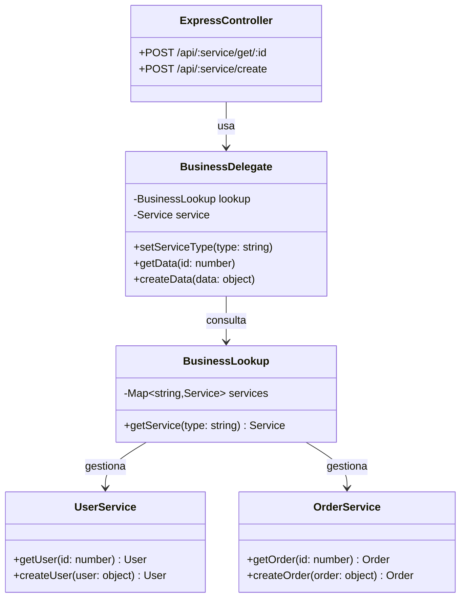
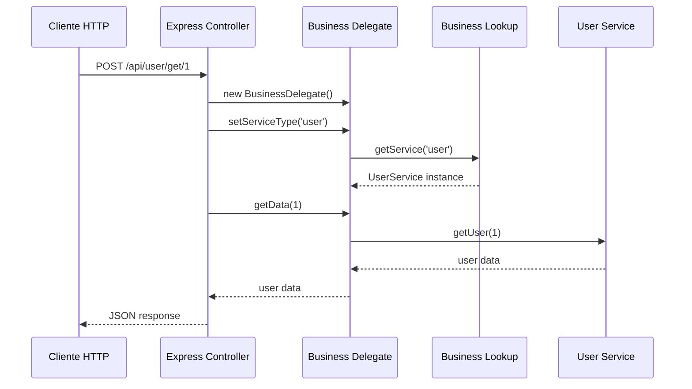
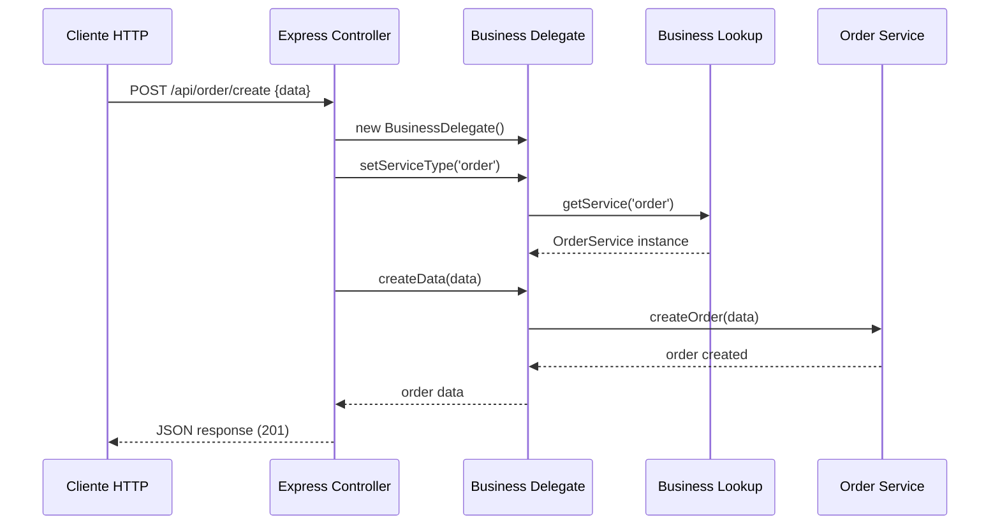
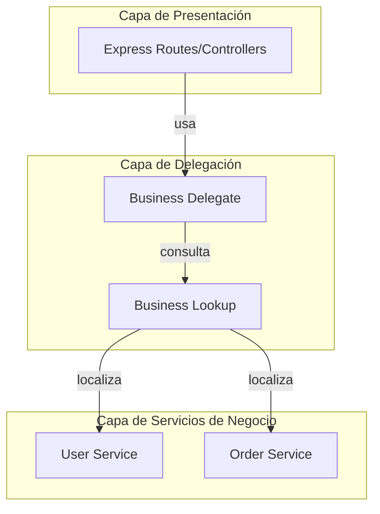

# Business Delegate Pattern

## Descripción

Este proyecto implementa el patrón de diseño **Business Delegate** en Node.js con Express. El patrón Business Delegate es un patrón de diseño J2EE que actúa como intermediario entre la capa de presentación y la capa de negocio, reduciendo el acoplamiento y ocultando la complejidad de la comunicación con los servicios de negocio.

## Ventajas del Patrón

- ✅ **Desacoplamiento**: Separa la capa de presentación de la lógica de negocio
- ✅ **Abstracción**: Oculta los detalles de implementación de los servicios
- ✅ **Reutilización**: El delegate puede ser usado por múltiples clientes
- ✅ **Flexibilidad**: Facilita el cambio de servicios sin afectar a los clientes
- ✅ **Centralización**: Manejo centralizado de excepciones y lógica de acceso

## Diagramas UML

### Diagrama de Clases



### Diagrama de Secuencia - Obtener Usuario



### Diagrama de Secuencia - Crear Orden



### Diagrama de Componentes



## Estructura del Proyecto

```
Business Delegate/
├── app.js          # Archivo principal con la implementación
├── package.json    # Dependencias del proyecto
└── README.md       # Este archivo
```

## Requisitos Previos

- Node.js (versión 14 o superior)
- npm (Node Package Manager)

## Instalación

1. **Clonar o descargar el proyecto**

2. **Instalar las dependencias**:
   ```bash
   npm install
   ```

   Las dependencias incluyen:
   - `express`: Framework web para Node.js
   - `cors`: Middleware para habilitar CORS
   - `body-parser`: Middleware para parsear JSON (incluido en Express 4.16+)

## Ejecución

### Modo Desarrollo

```bash
npm run dev
```

### Modo Alternativo

```bash
node app.js
```

El servidor se iniciará en `http://localhost:3000`

## API Endpoints

### 1. Obtener Usuario

**Endpoint**: `POST /api/user/get/:id`

**Descripción**: Obtiene la información de un usuario por su ID

**Ejemplo**:
```bash
curl -X POST http://localhost:3000/api/user/get/1
```

**Respuesta**:
```json
{
  "id": 1,
  "name": "Juan Pérez",
  "email": "juan@example.com"
}
```

### 2. Crear Usuario

**Endpoint**: `POST /api/user/create`

**Descripción**: Crea un nuevo usuario

**Body**:
```json
{
  "name": "María García",
  "email": "maria@example.com"
}
```

**Ejemplo**:
```bash
curl -X POST http://localhost:3000/api/user/create \
  -H "Content-Type: application/json" \
  -d '{"name":"María García","email":"maria@example.com"}'
```

**Respuesta**:
```json
{
  "id": 1,
  "name": "María García",
  "email": "maria@example.com",
  "createdAt": "2026-02-27T12:00:00.000Z"
}
```

### 3. Obtener Orden

**Endpoint**: `POST /api/order/get/:id`

**Descripción**: Obtiene la información de una orden por su ID

**Ejemplo**:
```bash
curl -X POST http://localhost:3000/api/order/get/1
```

**Respuesta**:
```json
{
  "id": 1,
  "product": "Laptop",
  "amount": 1200,
  "status": "pendiente"
}
```

### 4. Crear Orden

**Endpoint**: `POST /api/order/create`

**Descripción**: Crea una nueva orden

**Body**:
```json
{
  "product": "Mouse",
  "amount": 25
}
```

**Ejemplo**:
```bash
curl -X POST http://localhost:3000/api/order/create \
  -H "Content-Type: application/json" \
  -d '{"product":"Mouse","amount":25}'
```

**Respuesta**:
```json
{
  "id": 100,
  "product": "Mouse",
  "amount": 25,
  "date": "2026-02-27T12:00:00.000Z"
}
```

## Arquitectura del Código

### 1. Servicios de Negocio (Business Services)

Los servicios contienen la lógica de negocio real. En este ejemplo son simulados, pero en un caso real se conectarían a bases de datos o APIs externas.

- **UserService**: Gestiona operaciones relacionadas con usuarios
- **OrderService**: Gestiona operaciones relacionadas con órdenes

### 2. Business Lookup

Actúa como un registro de servicios. Mantiene un mapa de todos los servicios disponibles y proporciona un método para obtenerlos por tipo.

### 3. Business Delegate

Es el componente principal del patrón. Proporciona una interfaz unificada para acceder a diferentes servicios de negocio. Oculta la complejidad de:
- Localización de servicios
- Comunicación con servicios
- Manejo de errores

### 4. Controladores (Express Routes)

Los controladores HTTP usan el Business Delegate para procesar las peticiones. No tienen conocimiento directo de los servicios de negocio.

## Flujo de Ejecución

1. El cliente hace una petición HTTP al endpoint
2. El controlador crea una instancia de BusinessDelegate
3. El controlador configura el tipo de servicio en el delegate
4. El delegate usa BusinessLookup para obtener el servicio correcto
5. El delegate invoca el método del servicio
6. El servicio ejecuta la lógica de negocio
7. La respuesta se propaga de vuelta al cliente

## Manejo de Errores

El sistema incluye manejo de errores para los siguientes casos:

- **Servicio no encontrado**: Retorna error 404
- **Servicio no configurado**: Retorna error con mensaje descriptivo
- **Errores en creación**: Retorna error 400

## Pruebas con Bruno/Postman

Puedes importar estas peticiones en Bruno o Postman:

### Colección de Pruebas

```
GET User:      POST http://localhost:3000/api/user/get/1
CREATE User:   POST http://localhost:3000/api/user/create
GET Order:     POST http://localhost:3000/api/order/get/1
CREATE Order:  POST http://localhost:3000/api/order/create
```

## Extensión del Proyecto

Para agregar un nuevo servicio:

1. **Crear la clase del servicio**:
```javascript
class ProductService {
  getProduct(id) {
    return { id, name: 'Producto', price: 100 };
  }
  createProduct(product) {
    return { id: 1, ...product };
  }
}
```

2. **Registrar en BusinessLookup**:
```javascript
class BusinessLookup {
  constructor() {
    this.services = {
      'user': new UserService(),
      'order': new OrderService(),
      'product': new ProductService() // Nuevo servicio
    };
  }
}
```

3. **Usar en los endpoints**:
```bash
POST http://localhost:3000/api/product/get/1
POST http://localhost:3000/api/product/create
```

## Tecnologías Utilizadas

- **Node.js**: Entorno de ejecución
- **Express.js**: Framework web
- **CORS**: Middleware para habilitar Cross-Origin Resource Sharing
- **Body-Parser**: Parseo de JSON (integrado en Express)

## Autor

Proyecto educativo - Implementación del patrón Business Delegate

## Licencia

ISC
