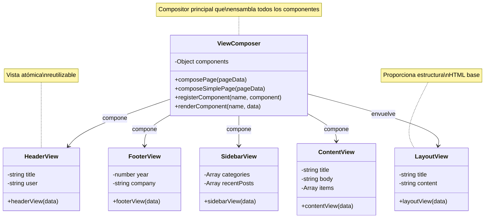
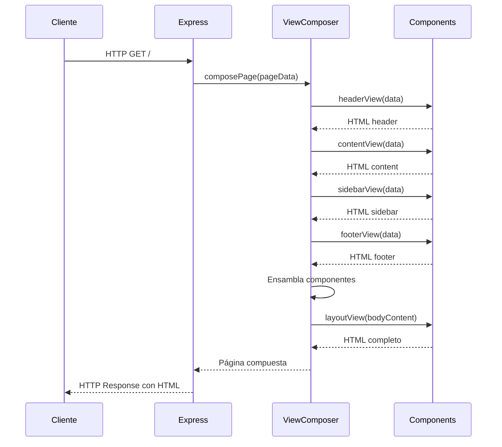
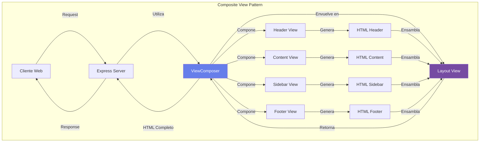

# Patrón Composite View

## Descripción

El patrón **Composite View** es un patrón de diseño empresarial que permite construir vistas complejas a partir de múltiples vistas atómicas más simples. En lugar de crear páginas monolíticas, este patrón promueve la creación de componentes de vista reutilizables que se pueden componer de diferentes maneras para formar páginas completas.

## Ventajas del Patrón

- **Reutilización**: Los componentes se pueden usar en múltiples páginas
- **Mantenibilidad**: Los cambios en un componente se reflejan automáticamente en todas las páginas que lo usan
- **Consistencia**: Garantiza una apariencia y comportamiento consistente en toda la aplicación
- **Separación de Responsabilidades**: Cada componente tiene una única responsabilidad
- **Flexibilidad**: Facilita la creación de diferentes layouts combinando componentes
- **Testing**: Permite probar componentes individuales de forma aislada

## Diagrama de Clases UML



## Diagrama de Secuencia



## Diagrama de Componentes



## Estructura del Proyecto

```
Composite View/
├── index.js              # Servidor Express principal
├── viewComposer.js       # Compositor de vistas (núcleo del patrón)
├── package.json          # Dependencias del proyecto
├── views/                # Componentes de vista
│   ├── header.js         # Componente de encabezado
│   ├── footer.js         # Componente de pie de página
│   ├── sidebar.js        # Componente de barra lateral
│   ├── content.js        # Componente de contenido principal
│   └── layout.js         # Layout base (estructura HTML)
└── README.md             # Documentación
```

## Instalación

1. **Clonar o descargar el proyecto**

2. **Instalar dependencias**:
   ```bash
   npm install
   ```

## Uso

### Iniciar el Servidor

```bash
npm start
```

El servidor se iniciará en el puerto 3000.

### Acceder a las Páginas

- **Página Principal**: http://localhost:3000/
  - Muestra una página completa con todos los componentes (header, content, sidebar, footer)

- **Página Acerca de**: http://localhost:3000/about
  - Demuestra la reutilización de componentes con diferente contenido

- **Página de Contacto**: http://localhost:3000/contact
  - Ejemplo de layout simple sin sidebar

- **API de Componentes**: http://localhost:3000/api/component/:name
  - Permite obtener componentes individuales
  - Ejemplos: `/api/component/header`, `/api/component/footer`

## Implementación

### 1. Crear un Nuevo Componente de Vista

Crea un archivo en la carpeta `views/`, por ejemplo `views/banner.js`:

```javascript
/**
 * Componente de Banner
 */
function bannerView(data = {}) {
  const message = data.message || 'Bienvenido';
  const type = data.type || 'info'; // info, success, warning, error

  return `
    <div class="banner banner-${type}">
      <div class="container">
        <p>${message}</p>
      </div>
    </div>
  `;
}

module.exports = bannerView;
```

### 2. Registrar el Componente en ViewComposer

Opción A - En el constructor de ViewComposer (`viewComposer.js`):

```javascript
const bannerView = require('./views/banner');

constructor() {
  this.components = {
    header: headerView,
    footer: footerView,
    sidebar: sidebarView,
    content: contentView,
    layout: layoutView,
    banner: bannerView  // ← Agregar aquí
  };
}
```

Opción B - Registrar dinámicamente:

```javascript
const composer = new ViewComposer();
composer.registerComponent('banner', bannerView);
```

### 3. Usar el Nuevo Componente

En tu ruta de Express:

```javascript
app.get('/promo', (req, res) => {
  // Renderizar el banner
  const bannerHTML = composer.renderComponent('banner', {
    message: '¡Oferta especial del 50%!',
    type: 'success'
  });

  const pageData = {
    pageTitle: 'Promoción',
    header: { title: 'Mi App' },
    content: { 
      title: 'Promoción Especial',
      body: bannerHTML + '<p>Detalles de la oferta...</p>'
    },
    footer: { company: 'Mi Empresa' }
  };

  const html = composer.composePage(pageData);
  res.send(html);
});
```

## Ejemplos de Uso

### Ejemplo 1: Página Completa

```javascript
const composer = new ViewComposer();

const html = composer.composePage({
  pageTitle: 'Mi Blog Personal',
  header: {
    title: 'Blog de Tecnología',
    user: 'Carlos'
  },
  content: {
    title: 'Últimas Publicaciones',
    body: '<p>Bienvenido a mi blog sobre tecnología.</p>',
    items: [
      { title: 'Post 1', description: 'Descripción...', link: '/post-1' },
      { title: 'Post 2', description: 'Descripción...', link: '/post-2' }
    ]
  },
  sidebar: {
    categories: ['JavaScript', 'Node.js', 'React'],
    recentPosts: [
      { title: 'Introducción a Node.js', link: '/posts/1' }
    ]
  },
  footer: {
    company: 'Carlos Tech Blog',
    year: 2026
  }
});
```

### Ejemplo 2: Página Simple (Sin Sidebar)

```javascript
const html = composer.composeSimplePage({
  pageTitle: 'Landing Page',
  header: {
    title: 'Producto Increíble'
  },
  content: {
    title: 'Bienvenido',
    body: '<p>Contenido de la landing page...</p>'
  },
  footer: {
    company: 'Mi Startup'
  }
});
```

### Ejemplo 3: Renderizar Componente Individual

```javascript
// Solo el header
const headerHTML = composer.renderComponent('header', {
  title: 'Mi App',
  user: 'Ana'
});

// Solo el footer
const footerHTML = composer.renderComponent('footer', {
  company: 'Tech Corp',
  year: 2026
});
```

## Flujo de Trabajo del Patrón

1. **Cliente realiza una solicitud HTTP** → Solicita una página específica

2. **Express recibe la request** → La ruta correspondiente maneja la solicitud

3. **Se preparan los datos** → Se define el objeto `pageData` con datos para cada componente

4. **ViewComposer.composePage()** → El compositor inicia el proceso de ensamblaje

5. **Renderizado de componentes individuales** → Cada componente genera su HTML:
   - Header View → HTML del encabezado
   - Content View → HTML del contenido principal
   - Sidebar View → HTML de la barra lateral
   - Footer View → HTML del pie de página

6. **Ensamblaje de componentes** → Los HTMLs se combinan en la estructura deseada

7. **Layout View envuelve todo** → Se agrega la estructura HTML base completa

8. **Respuesta al cliente** → Se envía el HTML completo y composito

## Características Avanzadas

### Composición Flexible

El patrón permite crear diferentes layouts según las necesidades:

```javascript
// Layout completo (header + content + sidebar + footer)
composer.composePage(data);

// Layout simple (header + content + footer)
composer.composeSimplePage(data);

// Componente individual
composer.renderComponent('header', data);
```

### Extensibilidad

Puedes registrar nuevos componentes en tiempo de ejecución:

```javascript
composer.registerComponent('alert', (data) => {
  return `<div class="alert">${data.message}</div>`;
});
```

### Reutilización

Los mismos componentes se reutilizan en múltiples páginas:

```javascript
// Página 1
composer.composePage({ header: { title: 'Blog' }, ... });

// Página 2
composer.composePage({ header: { title: 'Tienda' }, ... });

// El mismo componente header, diferente contenido
```

## Convenciones de Código

- **Nombres de funciones**: camelCase (ej: `headerView`, `composePage`)
- **Nombres de clases**: PascalCase (ej: `ViewComposer`)
- **Archivos de componentes**: Nombre descriptivo en singular (ej: `header.js`, `footer.js`)
- **Documentación**: Todos los archivos incluyen JSDoc completo
- **Componentes**: Cada componente es una función pura que recibe datos y retorna HTML

## Comparación con Otros Patrones

### vs Template View

| Aspecto | Composite View | Template View |
|---------|---------------|---------------|
| Composición | Componentes en código | Tags en templates |
| Reutilización | Alta | Media |
| Flexibilidad | Muy flexible | Limitada |
| Complejidad | Media | Baja |

### vs Single Template

| Aspecto | Composite View | Single Template |
|---------|---------------|-----------------|
| Mantenibilidad | Alta | Baja |
| Duplicación | Mínima | Alta |
| Testing | Fácil | Difícil |
| Escalabilidad | Excelente | Limitada |

## Tecnologías Utilizadas

- **Node.js**: Entorno de ejecución JavaScript
- **Express.js**: Framework web minimalista para Node.js
- **JavaScript Vanilla**: Sin frameworks frontend

## Mejores Prácticas

1. **Mantén los componentes pequeños y enfocados**: Cada componente debe tener una única responsabilidad

2. **Usa nombres descriptivos**: Los nombres deben indicar claramente qué hace el componente

3. **Documenta los parámetros**: Usa JSDoc para documentar qué datos espera cada componente

4. **Evita lógica compleja en los componentes**: Los componentes deben enfocarse en presentación, no en lógica de negocio

5. **Reutiliza componentes**: Si necesitas el mismo elemento en múltiples lugares, créalo como componente

6. **Mantén consistencia visual**: Usa los mismos estilos en todos los componentes

## Testing

Ejemplo de cómo podrías probar los componentes:

```javascript
// test/header.test.js
const headerView = require('../views/header');

describe('Header Component', () => {
  test('renders with default values', () => {
    const html = headerView();
    expect(html).toContain('Mi Aplicación');
    expect(html).toContain('Invitado');
  });

  test('renders with custom data', () => {
    const html = headerView({ title: 'Blog', user: 'Ana' });
    expect(html).toContain('Blog');
    expect(html).toContain('Ana');
  });
});
```

## Posibles Extensiones

1. **Sistema de Temas**: Permitir cambiar estilos dinámicamente
2. **Cache de Componentes**: Cachear componentes para mejor rendimiento
3. **Componentes Asíncronos**: Soportar componentes que cargan datos de API
4. **Internacionalización**: Agregar soporte para múltiples idiomas
5. **Server-Side Rendering + Client Hydration**: Combinar con frameworks como React/Vue

## Recursos Adicionales

- [Core J2EE Patterns - Composite View](https://www.oracle.com/java/technologies/composite-view.html)
- [Enterprise Integration Patterns](https://www.enterpriseintegrationpatterns.com/)
- [Design Patterns: Elements of Reusable Object-Oriented Software](https://en.wikipedia.org/wiki/Design_Patterns)

## Autor

Desarrollo académico - Temas Selectos de Programación

## Licencia

ISC
