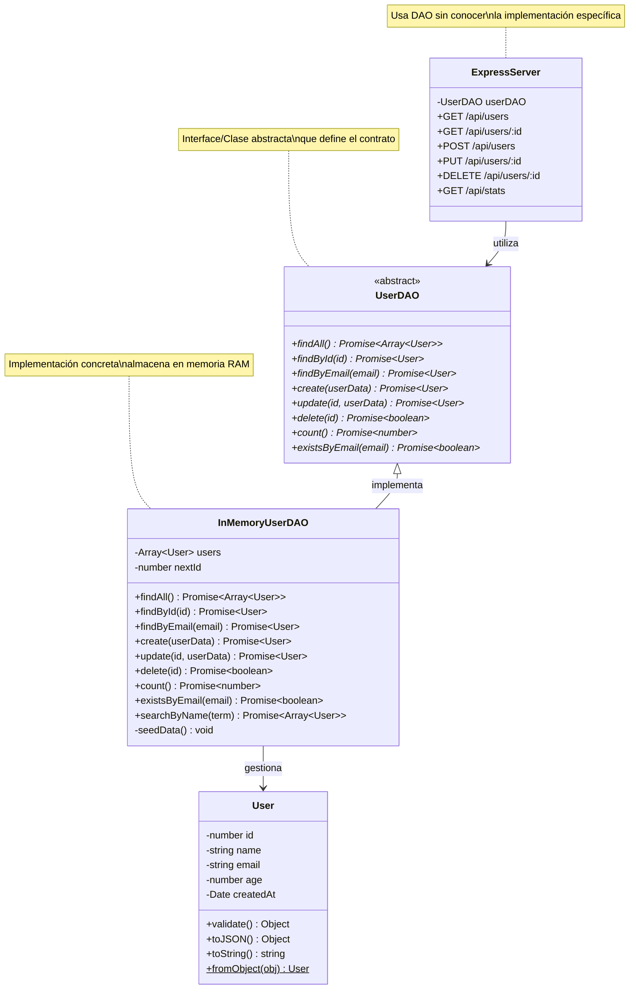
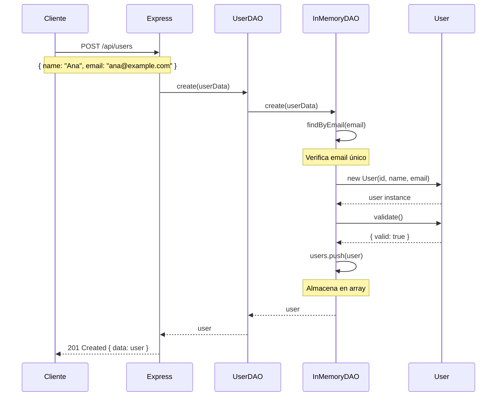
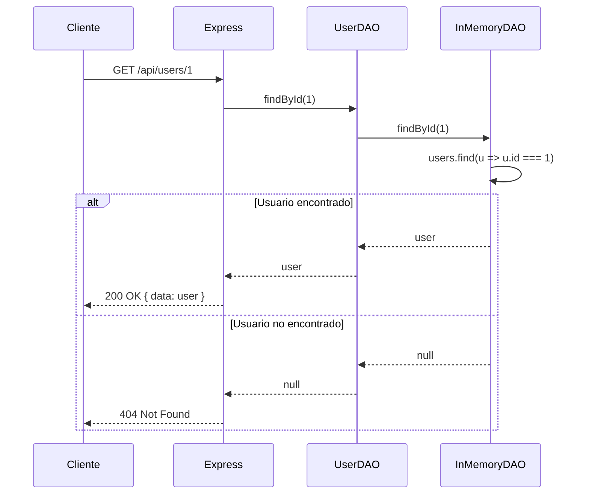
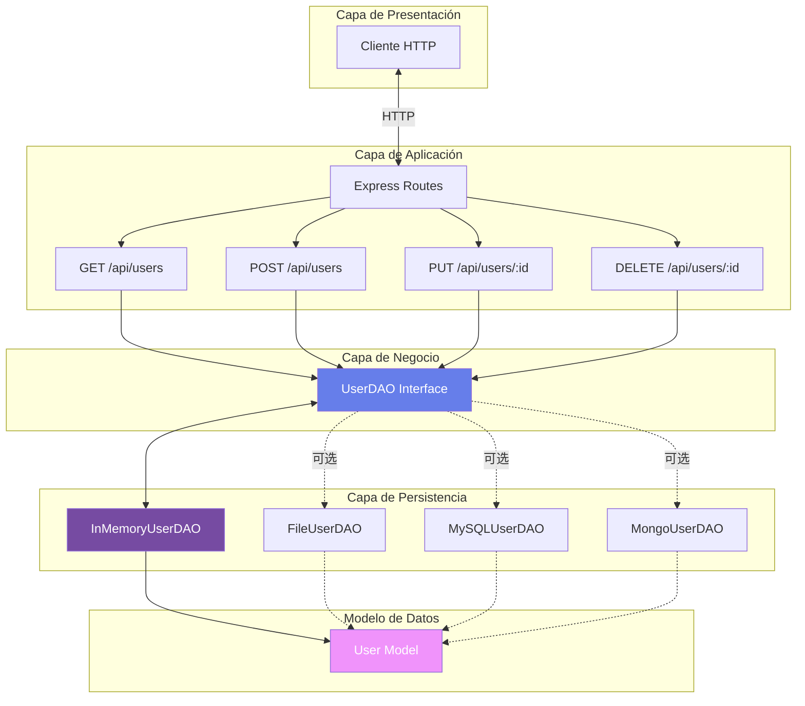

# Patrón Data Access Object (DAO)

## Descripción

El patrón **Data Access Object (DAO)** es un patrón de diseño estructural que proporciona una interfaz abstracta para acceder a datos de cualquier fuente (base de datos, archivos, servicios web, etc.). Este patrón separa la lógica de acceso a datos de la lógica de negocio, permitiendo cambiar la implementación de almacenamiento sin afectar el resto de la aplicación.

## Problema que Resuelve

Sin el patrón DAO, el código de negocio está fuertemente acoplado con la tecnología de persistencia:

```javascript
// ❌ Sin DAO - Código acoplado a la implementación
app.get('/users', (req, res) => {
  // Lógica SQL directa en la ruta
  db.query('SELECT * FROM users', (err, results) => {
    // Si cambias de SQL a MongoDB, debes modificar TODAS las rutas
    res.json(results);
  });
});
```

Con DAO, el código de negocio está desacoplado:

```javascript
// ✅ Con DAO - Código desacoplado
app.get('/users', async (req, res) => {
  // Usa la interfaz DAO, sin importar la implementación
  const users = await userDAO.findAll();
  res.json(users);
  // Puedes cambiar de InMemory a MySQL sin tocar esta línea
});
```

## Ventajas del Patrón

- **Separación de Responsabilidades**: Separa la lógica de datos de la lógica de negocio
- **Abstracción**: Oculta los detalles de implementación del almacenamiento
- **Flexibilidad**: Permite cambiar la fuente de datos sin modificar el código de negocio
- **Reutilización**: Los DAOs pueden ser reutilizados en diferentes partes de la aplicación
- **Testing**: Facilita el testing usando implementaciones mock o in-memory
- **Mantenibilidad**: Centraliza todo el código de acceso a datos en un solo lugar
- **Consistencia**: Garantiza operaciones CRUD consistentes

## Diagrama de Clases UML



## Diagrama de Secuencia - Operación CREATE



## Diagrama de Secuencia - Operación READ



## Diagrama de Arquitectura



## Estructura del Proyecto

```
Data Access Object/
├── index.js              # Servidor Express con API REST
├── package.json          # Dependencias del proyecto
├── .gitignore            # Archivos a ignorar
├── models/               # Modelos de datos
│   └── User.js           # Modelo de Usuario
├── dao/                  # Data Access Objects
│   ├── UserDAO.js        # Interface/Clase abstracta
│   └── InMemoryUserDAO.js # Implementación en memoria
└── README.md             # Documentación
```

## Instalación

1. **Clonar o descargar el proyecto**

2. **Instalar dependencias**:
   ```bash
   npm install
   ```

## Uso

### Iniciar el Servidor

```bash
npm start
```

El servidor se iniciará en el puerto 3000.

### Endpoints de la API

#### 1. Obtener todos los usuarios

```bash
GET http://localhost:3000/api/users
```

**Respuesta:**
```json
{
  "success": true,
  "count": 3,
  "data": [
    {
      "id": 1,
      "name": "Juan Pérez",
      "email": "juan@example.com",
      "age": 28,
      "createdAt": "2026-02-27T10:30:00.000Z"
    },
    ...
  ]
}
```

#### 2. Obtener un usuario por ID

```bash
GET http://localhost:3000/api/users/1
```

**Respuesta:**
```json
{
  "success": true,
  "data": {
    "id": 1,
    "name": "Juan Pérez",
    "email": "juan@example.com",
    "age": 28,
    "createdAt": "2026-02-27T10:30:00.000Z"
  }
}
```

#### 3. Buscar usuario por email

```bash
GET http://localhost:3000/api/users/email/juan@example.com
```

#### 4. Buscar usuarios por nombre

```bash
GET http://localhost:3000/api/users/search/Juan
```

**Respuesta:**
```json
{
  "success": true,
  "count": 1,
  "data": [
    {
      "id": 1,
      "name": "Juan Pérez",
      "email": "juan@example.com",
      "age": 28
    }
  ]
}
```

#### 5. Crear un nuevo usuario

```bash
POST http://localhost:3000/api/users
Content-Type: application/json

{
  "name": "Ana Martínez",
  "email": "ana@example.com",
  "age": 30
}
```

**Respuesta:**
```json
{
  "success": true,
  "message": "Usuario creado exitosamente",
  "data": {
    "id": 4,
    "name": "Ana Martínez",
    "email": "ana@example.com",
    "age": 30,
    "createdAt": "2026-02-27T11:00:00.000Z"
  }
}
```

#### 6. Actualizar un usuario

```bash
PUT http://localhost:3000/api/users/1
Content-Type: application/json

{
  "name": "Juan Carlos Pérez",
  "age": 29
}
```

**Respuesta:**
```json
{
  "success": true,
  "message": "Usuario actualizado exitosamente",
  "data": {
    "id": 1,
    "name": "Juan Carlos Pérez",
    "email": "juan@example.com",
    "age": 29,
    "createdAt": "2026-02-27T10:30:00.000Z"
  }
}
```

#### 7. Eliminar un usuario

```bash
DELETE http://localhost:3000/api/users/1
```

**Respuesta:**
```json
{
  "success": true,
  "message": "Usuario eliminado exitosamente"
}
```

#### 8. Obtener estadísticas

```bash
GET http://localhost:3000/api/stats
```

**Respuesta:**
```json
{
  "success": true,
  "data": {
    "totalUsers": 3,
    "usersWithAge": 3,
    "averageAge": 28.3,
    "daoImplementation": "InMemoryUserDAO"
  }
}
```

## Ejemplos con cURL

```bash
# Obtener todos los usuarios
curl http://localhost:3000/api/users

# Obtener usuario por ID
curl http://localhost:3000/api/users/1

# Crear usuario
curl -X POST http://localhost:3000/api/users \
  -H "Content-Type: application/json" \
  -d '{"name":"Pedro Sánchez","email":"pedro@example.com","age":35}'

# Actualizar usuario
curl -X PUT http://localhost:3000/api/users/1 \
  -H "Content-Type: application/json" \
  -d '{"name":"Juan López","age":30}'

# Eliminar usuario
curl -X DELETE http://localhost:3000/api/users/1

# Buscar por nombre
curl http://localhost:3000/api/users/search/Juan

# Obtener estadísticas
curl http://localhost:3000/api/stats
```

## Implementación

### Crear una Nueva Implementación de DAO

El poder del patrón DAO es que puedes crear diferentes implementaciones sin cambiar el código de negocio. Por ejemplo, para crear un DAO que persista en archivos JSON:

**Paso 1**: Crea `dao/FileUserDAO.js`

```javascript
const UserDAO = require('./UserDAO');
const User = require('../models/User');
const fs = require('fs').promises;

class FileUserDAO extends UserDAO {
  constructor(filePath = './users.json') {
    super();
    this.filePath = filePath;
  }

  async findAll() {
    const data = await fs.readFile(this.filePath, 'utf8');
    const users = JSON.parse(data);
    return users.map(u => User.fromObject(u));
  }

  async findById(id) {
    const users = await this.findAll();
    return users.find(u => u.id === parseInt(id)) || null;
  }

  async create(userData) {
    const users = await this.findAll();
    const newId = Math.max(...users.map(u => u.id), 0) + 1;
    
    const newUser = new User(newId, userData.name, userData.email, userData.age);
    
    const validation = newUser.validate();
    if (!validation.valid) {
      throw new Error(`Datos inválidos: ${validation.errors.join(', ')}`);
    }
    
    users.push(newUser);
    await fs.writeFile(this.filePath, JSON.stringify(users, null, 2));
    
    return newUser;
  }

  // Implementar los demás métodos...
}

module.exports = FileUserDAO;
```

**Paso 2**: Cambia la implementación en `index.js`

```javascript
// Antes:
// const InMemoryUserDAO = require('./dao/InMemoryUserDAO');
// const userDAO = new InMemoryUserDAO();

// Ahora:
const FileUserDAO = require('./dao/FileUserDAO');
const userDAO = new FileUserDAO('./data/users.json');

// ¡Todo el resto del código sigue funcionando sin cambios!
```

### Extensión: Agregar Nuevos Métodos

Puedes agregar métodos específicos a tu implementación:

```javascript
class InMemoryUserDAO extends UserDAO {
  // ... métodos existentes ...

  /**
   * Obtiene usuarios mayores de edad
   */
  async findAdults() {
    return this.users.filter(u => u.age >= 18);
  }

  /**
   * Obtiene usuarios ordenados por edad
   */
  async findAllOrderedByAge() {
    const users = [...this.users];
    return users.sort((a, b) => (a.age || 0) - (b.age || 0));
  }
}
```

## Flujo de Trabajo

1. **Cliente realiza petición HTTP** → Envía una solicitud a la API REST

2. **Express recibe la petición** → La ruta correspondiente maneja la request

3. **Ruta llama al DAO** → Usa la interfaz UserDAO sin conocer la implementación

4. **DAO ejecuta la operación** → La implementación concreta (InMemory, File, MySQL) ejecuta la lógica

5. **DAO retorna los datos** → Devuelve el resultado como objetos User

6. **Express envía respuesta** → Serializa y envía los datos al cliente

## Ventajas de la Arquitectura

### Desacoplamiento

```javascript
// El código de negocio no conoce la implementación
app.get('/api/users', async (req, res) => {
  const users = await userDAO.findAll();
  // ¿Vienen de memoria? ¿De archivo? ¿De MySQL?
  // ¡No importa! La interfaz es la misma
  res.json(users);
});
```

### Facilidad para Testing

```javascript
// En tests, usa un DAO mock
class MockUserDAO extends UserDAO {
  async findAll() {
    return [
      new User(1, 'Test User', 'test@example.com', 25)
    ];
  }
}

// En producción, usa el DAO real
const userDAO = process.env.NODE_ENV === 'test' 
  ? new MockUserDAO() 
  : new MySQLUserDAO();
```

### Cambio de Tecnología sin Dolor

```javascript
// Día 1: Usas InMemory para desarrollo rápido
const userDAO = new InMemoryUserDAO();

// Día 30: Cambias a MySQL para producción
const userDAO = new MySQLUserDAO(config);

// Día 60: Migras a MongoDB
const userDAO = new MongoUserDAO(connectionString);

// ¡Sin cambiar una sola línea en tus rutas!
```

## Comparación con Otros Patrones

### vs Direct Database Access

| Aspecto | DAO | Direct DB Access |
|---------|-----|------------------|
| Acoplamiento | Bajo | Alto |
| Testing | Fácil | Difícil |
| Cambiar BD | Simple | Complejo |
| Reutilización | Alta | Baja |
| Mantenibilidad | Excelente | Pobre |

### vs Repository Pattern

| Aspecto | DAO | Repository |
|---------|-----|------------|
| Foco | Persistencia | Dominio |
| Complejidad | Menor | Mayor |
| Queries complejas | Limitadas | Ricas |
| Casos de uso | CRUD simple | DDD, complejos |

## Mejores Prácticas

1. **Define una interfaz clara**: Usa una clase abstracta o TypeScript interfaces

2. **Métodos asíncronos**: Todas las operaciones de datos deben retornar Promises

3. **Validación en el modelo**: El modelo User valida sus propios datos

4. **Manejo de errores consistente**: Los DAOs deben lanzar errores descriptivos

5. **Transacciones**: Para operaciones complejas, implementa soporte transaccional

6. **No expongas detalles de implementación**: El DAO debe ser agnóstico de la fuente

7. **Un DAO por entidad**: UserDAO, ProductDAO, OrderDAO, etc.

8. **Métodos nombrados claramente**: `findById`, `create`, `update`, `delete`

## Posibles Implementaciones

### InMemoryUserDAO ✅
- **Pro**: Rápido, simple, ideal para desarrollo
- **Con**: Datos se pierden al reiniciar
- **Uso**: Desarrollo, testing, prototipos

### FileUserDAO
- **Pro**: Persistencia simple sin DB
- **Con**: Lento con muchos datos
- **Uso**: Aplicaciones pequeñas, scripts

### MySQLUserDAO
- **Pro**: Relacional, transaccional, robusto
- **Con**: Requiere servidor MySQL
- **Uso**: Aplicaciones empresariales

### MongoUserDAO
- **Pro**: Flexible, escalable, NoSQL
- **Con**: Requiere servidor MongoDB
- **Uso**: Apps con datos no estructurados

### CachedUserDAO (Decorator)
- **Pro**: Combina cache + persistencia
- **Con**: Más complejo
- **Uso**: Alta concurrencia

## Extensiones Avanzadas

### 1. DAO Factory

```javascript
class DAOFactory {
  static createUserDAO(type) {
    switch(type) {
      case 'memory':
        return new InMemoryUserDAO();
      case 'file':
        return new FileUserDAO('./users.json');
      case 'mysql':
        return new MySQLUserDAO(mysqlConfig);
      default:
        throw new Error('Unknown DAO type');
    }
  }
}

// Uso
const userDAO = DAOFactory.createUserDAO(process.env.DAO_TYPE || 'memory');
```

### 2. Generic DAO

```javascript
class GenericDAO {
  constructor(model) {
    this.model = model;
  }

  async findAll() { /* ... */ }
  async findById(id) { /* ... */ }
  async create(data) { /* ... */ }
  async update(id, data) { /* ... */ }
  async delete(id) { /* ... */ }
}

// Uso
const userDAO = new GenericDAO(User);
const productDAO = new GenericDAO(Product);
```

## Tecnologías Utilizadas

- **Node.js**: Entorno de ejecución JavaScript
- **Express.js**: Framework web para construir la API REST
- **JavaScript ES6+**: Clases, async/await, destructuring

## Testing

Ejemplo de cómo testear con el patrón DAO:

```javascript
// test/userDAO.test.js
const InMemoryUserDAO = require('../dao/InMemoryUserDAO');

describe('InMemoryUserDAO', () => {
  let dao;

  beforeEach(() => {
    dao = new InMemoryUserDAO();
  });

  test('findAll returns all users', async () => {
    const users = await dao.findAll();
    expect(users.length).toBeGreaterThan(0);
  });

  test('create adds a new user', async () => {
    const userData = {
      name: 'Test User',
      email: 'test@example.com',
      age: 25
    };
    
    const user = await dao.create(userData);
    expect(user.id).toBeDefined();
    expect(user.name).toBe('Test User');
  });

  test('create throws error for duplicate email', async () => {
    const userData = {
      name: 'Duplicate',
      email: 'juan@example.com' // Email que ya existe
    };
    
    await expect(dao.create(userData)).rejects.toThrow();
  });
});
```

## Recursos Adicionales

- [Core J2EE Patterns - Data Access Object](https://www.oracle.com/java/technologies/dataaccessobject.html)
- [Martin Fowler - Patterns of Enterprise Application Architecture](https://martinfowler.com/eaaCatalog/)
- [Repository vs DAO](https://stackoverflow.com/questions/8550124/what-is-the-difference-between-dao-and-repository-patterns)

## Autor

Desarrollo académico - Temas Selectos de Programación

## Licencia

ISC
