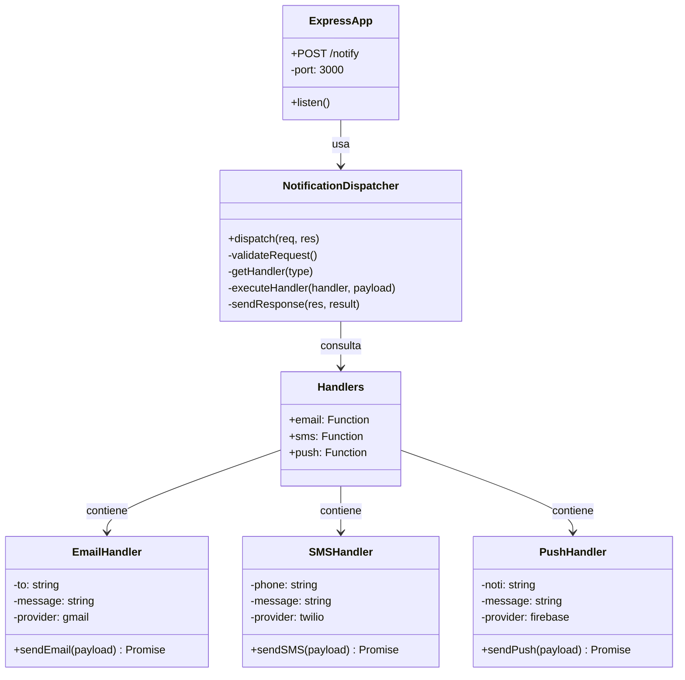
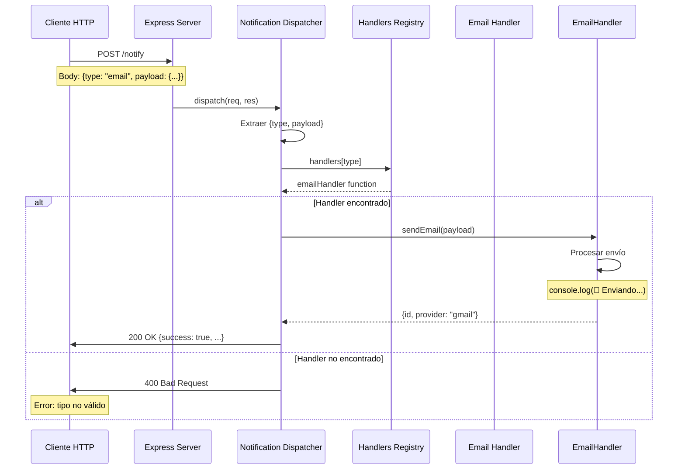
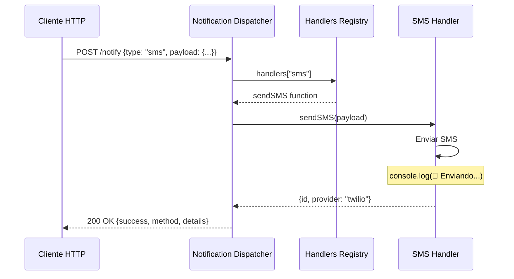
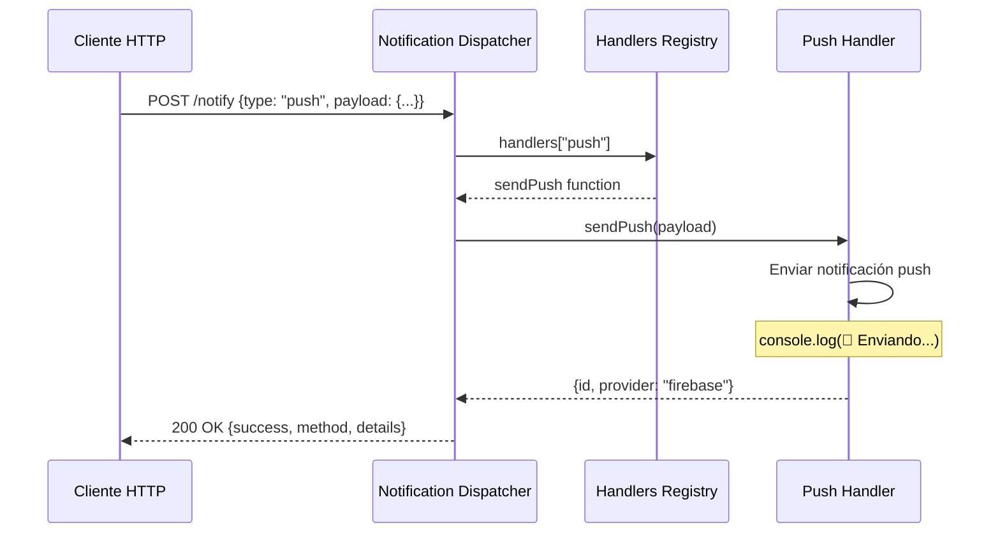
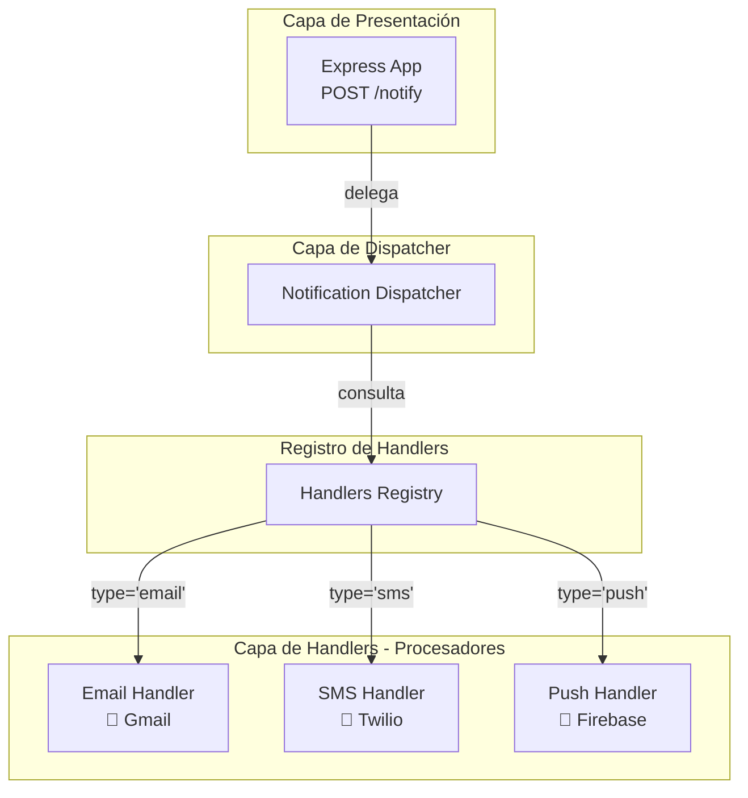
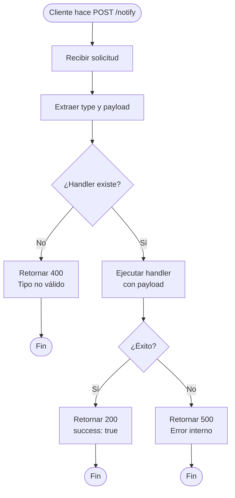

# Dispatcher Pattern - Sistema de Notificaciones

## Descripción

Este proyecto implementa el patrón de diseño **Dispatcher** (también conocido como Front Controller simplificado) en Node.js con Express. El patrón Dispatcher recibe solicitudes y las despacha al manejador apropiado basándose en el tipo de solicitud, centralizando el enrutamiento y la lógica de distribución.

## Ventajas del Patrón

- ✅ **Centralización**: Un único punto de entrada para todas las notificaciones
- ✅ **Extensibilidad**: Fácil agregar nuevos tipos de notificaciones
- ✅ **Mantenibilidad**: Lógica de despacho separada de los manejadores
- ✅ **Flexibilidad**: Cambiar implementaciones sin afectar el dispatcher
- ✅ **Testabilidad**: Componentes independientes fáciles de probar

## Diagramas UML

### Diagrama de Clases



### Diagrama de Secuencia - Envío de Email



### Diagrama de Secuencia - Envío de SMS



### Diagrama de Secuencia - Envío de Push Notification



### Diagrama de Componentes



### Diagrama de Flujo - Proceso de Despacho



## Estructura del Proyecto

```
Dispatcher/
├── src/
│   ├── app.js                      # Servidor Express principal
│   ├── notificationDispatcher.js  # Lógica de despacho
│   └── handlers.js                 # Manejadores de notificaciones
├── package.json                    # Dependencias del proyecto
├── README.md                       # Este archivo
├── EJEMPLOS.md                     # Ejemplos de uso
├── GUIA_RAPIDA.md                 # Guía rápida
└── .gitignore                     # Archivos a ignorar
```

## Requisitos Previos

- Node.js (versión 14 o superior)
- npm (Node Package Manager)

## Instalación

1. **Clonar o descargar el proyecto**

2. **Instalar las dependencias**:
   ```bash
   npm install
   ```

   Las dependencias incluyen:
   - `express`: Framework web para Node.js

## Ejecución

### Modo Producción/Desarrollo

```bash
npm start
```

El servidor se iniciará en `http://localhost:3000`

## API Endpoint

### Enviar Notificación

**Endpoint**: `POST /notify`

**Descripción**: Envía una notificación a través del canal especificado (email, SMS o push)

### Tipos de Notificaciones Soportadas

#### 1. Email (📧)

**Body**:
```json
{
  "type": "email",
  "payload": {
    "to": "usuario@example.com",
    "message": "Mensaje del correo"
  }
}
```

**Ejemplo cURL**:
```bash
curl -X POST http://localhost:3000/notify \
  -H "Content-Type: application/json" \
  -d '{
    "type": "email",
    "payload": {
      "to": "juan@example.com",
      "message": "Bienvenido a nuestro sistema"
    }
  }'
```

**Respuesta**:
```json
{
  "success": true,
  "method": "email",
  "details": {
    "id": 1709054400000,
    "provider": "gmail"
  }
}
```

#### 2. SMS (📱)

**Body**:
```json
{
  "type": "sms",
  "payload": {
    "phone": "+52 55 1234 5678",
    "message": "Mensaje de texto"
  }
}
```

**Ejemplo cURL**:
```bash
curl -X POST http://localhost:3000/notify \
  -H "Content-Type: application/json" \
  -d '{
    "type": "sms",
    "payload": {
      "phone": "+52 55 1234 5678",
      "message": "Tu código de verificación es: 123456"
    }
  }'
```

**Respuesta**:
```json
{
  "success": true,
  "method": "sms",
  "details": {
    "id": 1709054400000,
    "provider": "twilio"
  }
}
```

#### 3. Push Notification (🔔)

**Body**:
```json
{
  "type": "push",
  "payload": {
    "noti": "device_token_123",
    "message": "Mensaje de notificación"
  }
}
```

**Ejemplo cURL**:
```bash
curl -X POST http://localhost:3000/notify \
  -H "Content-Type: application/json" \
  -d '{
    "type": "push",
    "payload": {
      "noti": "device_token_abc123",
      "message": "Tienes una nueva actualización"
    }
  }'
```

**Respuesta**:
```json
{
  "success": true,
  "method": "push",
  "details": {
    "id": 1709054400000,
    "provider": "firebase"
  }
}
```

## Arquitectura del Código

### 1. Express App ([app.js](src/app.js))

Punto de entrada de la aplicación. Configura el servidor Express y define la ruta única `/notify` que maneja todas las solicitudes de notificaciones.

**Responsibilidades**:
- Inicializar el servidor
- Configurar middleware
- Definir rutas
- Delegar al dispatcher

### 2. Notification Dispatcher ([notificationDispatcher.js](src/notificationDispatcher.js))

Componente central del patrón. Recibe las solicitudes y las despacha al handler apropiado.

**Responsibilidades**:
- Extraer tipo y payload de la solicitud
- Validar que el tipo sea válido
- Obtener el handler correspondiente
- Ejecutar el handler con el payload
- Manejar errores
- Enviar respuesta al cliente

### 3. Handlers ([handlers.js](src/handlers.js))

Registro de manejadores de notificaciones. Cada handler es una función asíncrona que procesa un tipo específico de notificación.

**Handlers disponibles**:
- `email`: Envía notificaciones por correo electrónico (Gmail)
- `sms`: Envía mensajes de texto (Twilio)
- `push`: Envía notificaciones push (Firebase)

## Flujo de Ejecución

1. Cliente envía POST request a `/notify` con `{type, payload}`
2. Express recibe la solicitud y la pasa al dispatcher
3. Dispatcher extrae `type` y `payload` del body
4. Dispatcher busca el handler correspondiente en el registro
5. Si el handler existe, lo ejecuta con el payload
6. Handler procesa la notificación y retorna resultado
7. Dispatcher envía respuesta exitosa al cliente
8. Si hay errores, se capturan y se envía respuesta apropiada

## Manejo de Errores

El sistema incluye manejo de errores para los siguientes casos:

### Error 400 - Tipo de notificación no válido
```json
{
  "error": "El tipo de notificación 'xxx' no es válido. Opciones: email, sms, push"
}
```

### Error 500 - Error interno del servidor
```json
{
  "error": "Error interno procesando la notificación"
}
```

## Extensión del Proyecto

### Agregar un Nuevo Tipo de Notificación

#### 1. Crear el handler en [handlers.js](src/handlers.js):

```javascript
const sendWhatsApp = async (payload) => {
    console.log(`📲 Enviando WhatsApp a ${payload.phone}: "${payload.message}"`);
    return { 
        id: Date.now(), 
        provider: 'whatsapp-business' 
    };
};

module.exports = {
    email: sendEmail,
    sms: sendSMS,
    push: sendPush,
    whatsapp: sendWhatsApp  // ← Nuevo handler
};
```

#### 2. Usar el nuevo handler:

```bash
curl -X POST http://localhost:3000/notify \
  -H "Content-Type: application/json" \
  -d '{
    "type": "whatsapp",
    "payload": {
      "phone": "+52 55 1234 5678",
      "message": "Hola desde WhatsApp"
    }
  }'
```

### Agregar Middleware de Autenticación

```javascript
// En app.js
const authenticate = (req, res, next) => {
    const token = req.headers['authorization'];
    if (!token || token !== 'Bearer secret-token') {
        return res.status(401).json({ error: 'No autorizado' });
    }
    next();
};

app.post('/notify', authenticate, notificationDispatcher);
```

### Agregar Validación de Payload

```javascript
// En notificationDispatcher.js
const validatePayload = (type, payload) => {
    const validators = {
        email: (p) => p.to && p.message,
        sms: (p) => p.phone && p.message,
        push: (p) => p.noti && p.message
    };
    
    return validators[type] ? validators[type](payload) : false;
};

// Usar en el dispatcher
if (!validatePayload(type, payload)) {
    return res.status(400).json({ 
        error: 'Payload inválido para el tipo de notificación' 
    });
}
```

## Casos de Uso Comunes

### 1. Sistema de Autenticación
- Envío de códigos de verificación por SMS
- Confirmación de registro por email
- Notificaciones push de inicio de sesión

### 2. E-Commerce
- Confirmación de pedido por email
- Notificación de envío por SMS
- Ofertas y promociones por push

### 3. Sistema de Alertas
- Alertas críticas por email y SMS
- Recordatorios por push notification
- Notificaciones de eventos importantes

### 4. Aplicación Bancaria
- Alertas de transacciones por SMS
- Resumen mensual por email
- Notificaciones de seguridad por push

## Tecnologías Utilizadas

- **Node.js**: Entorno de ejecución
- **Express.js**: Framework web minimalista
- **JavaScript ES6+**: Async/await, destructuring, módulos

## Patrones de Diseño Implementados

### Dispatcher Pattern
Centraliza el enrutamiento de solicitudes a handlers específicos basándose en el tipo de solicitud.

### Strategy Pattern (Implícito)
Cada handler es una estrategia diferente para enviar notificaciones, intercambiables dinámicamente.

### Registry Pattern
Los handlers se mantienen en un registro (objeto) para fácil acceso y extensión.

## Testing

### Pruebas Manuales

Usar las herramientas de tu preferencia:
- cURL (línea de comandos)
- Postman
- Bruno
- Insomnia
- Thunder Client (VS Code)

### Pruebas Automatizadas (Opcional)

```javascript
// test/notification.test.js
const request = require('supertest');
const app = require('../src/app');

describe('POST /notify', () => {
    it('should send email notification', async () => {
        const response = await request(app)
            .post('/notify')
            .send({
                type: 'email',
                payload: { to: 'test@example.com', message: 'Test' }
            });
        
        expect(response.status).toBe(200);
        expect(response.body.success).toBe(true);
        expect(response.body.method).toBe('email');
    });
    
    it('should return 400 for invalid type', async () => {
        const response = await request(app)
            .post('/notify')
            .send({
                type: 'invalid',
                payload: { message: 'Test' }
            });
        
        expect(response.status).toBe(400);
    });
});
```

## Mejoras Futuras

- [ ] Implementar sistema de colas para procesamiento asíncrono
- [ ] Agregar reintentos automáticos en caso de falla
- [ ] Implementar rate limiting
- [ ] Agregar logging estructurado
- [ ] Implementar autenticación y autorización
- [ ] Agregar métricas y monitoreo
- [ ] Implementar templates para mensajes
- [ ] Agregar soporte para notificaciones masivas
- [ ] Implementar webhooks para callbacks
- [ ] Agregar persistencia de historial de notificaciones

## Comparación con Otros Patrones

| Patrón | Similitud | Diferencia |
|--------|-----------|------------|
| **Command** | Encapsula acciones | Dispatcher no encapsula, solo enruta |
| **Strategy** | Intercambia algoritmos | Dispatcher selecciona dinámicamente |
| **Chain of Responsibility** | Pasa solicitud | Dispatcher va directo al handler |
| **Front Controller** | Punto único de entrada | Dispatcher es más simple, sin vistas |

## Recursos de Aprendizaje

- [Express.js Documentation](https://expressjs.com/)
- [Node.js Best Practices](https://github.com/goldbergyoni/nodebestpractices)
- [Design Patterns in JavaScript](https://www.patterns.dev/)

## Autor

Proyecto educativo - Implementación del patrón Dispatcher

## Licencia

ISC
