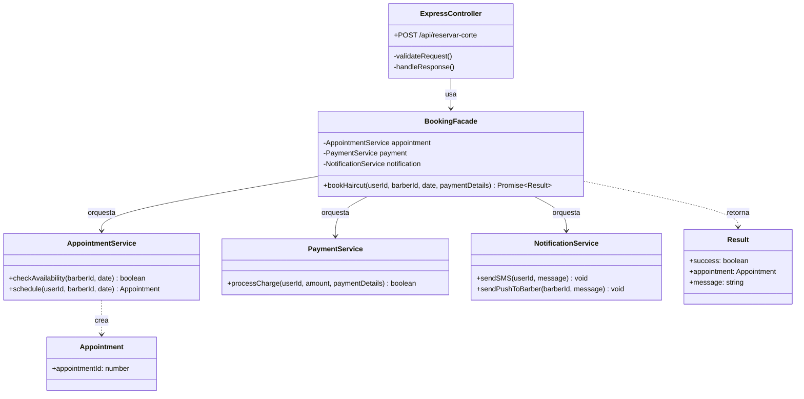
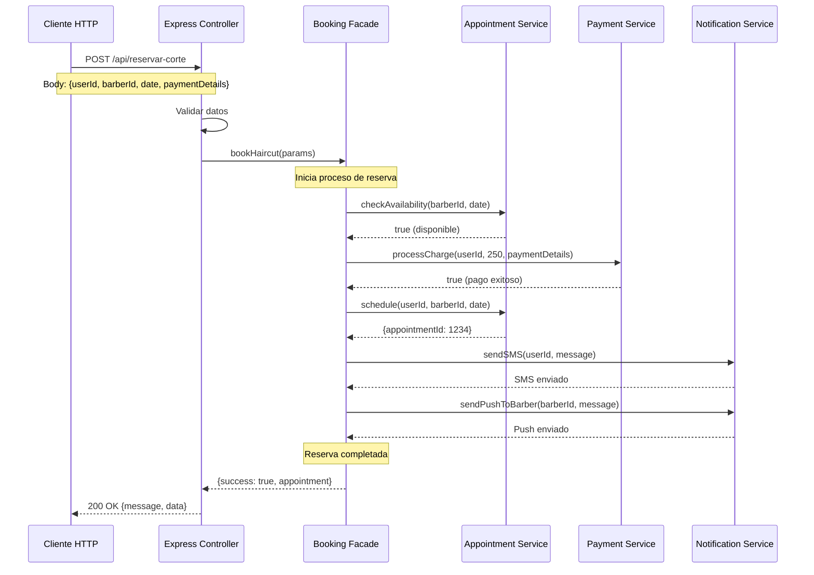
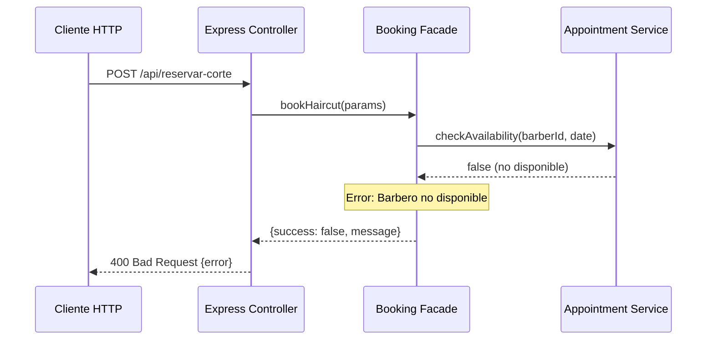
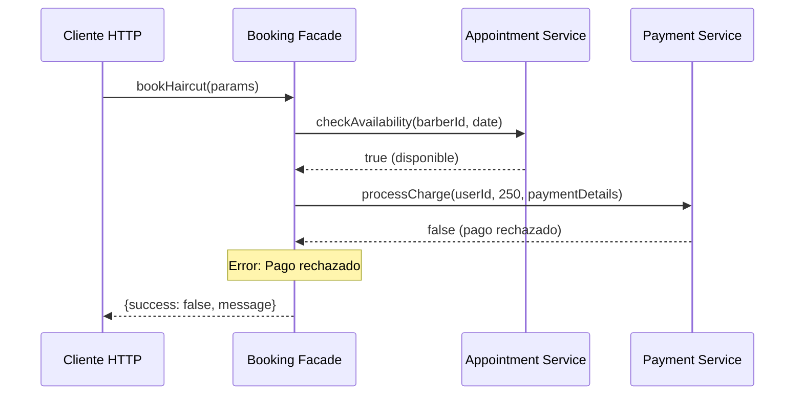
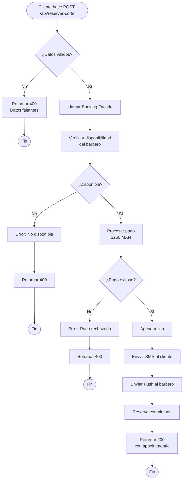
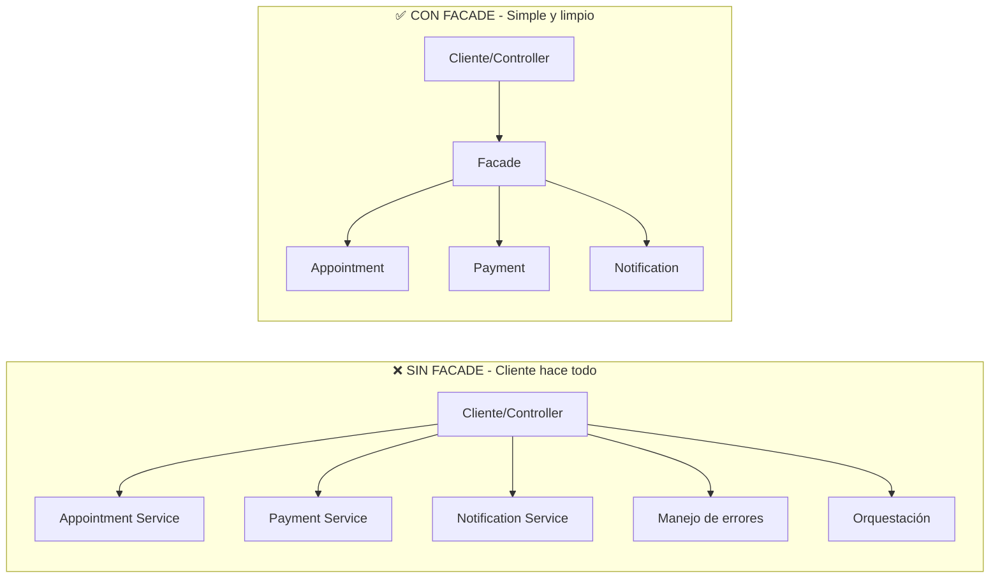

# Facade Pattern - Sistema de Reservas de Barbería

## Descripción

Este proyecto implementa el patrón de diseño **Facade** en Node.js con Express. El patrón Facade proporciona una interfaz unificada y simplificada para un conjunto de interfaces complejas en un subsistema, facilitando su uso y reduciendo las dependencias entre los clientes y los subsistemas.

Este sistema simula una aplicación de reservas para una barbería llamada **PrimeCorte**, que coordina múltiples servicios complejos (citas, pagos, notificaciones) a través de una fachada simple.

## Ventajas del Patrón

- ✅ **Simplificación**: Proporciona una interfaz simple para un sistema complejo
- ✅ **Desacoplamiento**: Los clientes no dependen directamente de los subsistemas
- ✅ **Mantenibilidad**: Cambios en subsistemas no afectan a los clientes
- ✅ **Organización**: Lógica compleja encapsulada y organizada
- ✅ **Reutilización**: La fachada puede ser usada por múltiples clientes
- ✅ **Control centralizado**: Manejo de errores y validaciones en un solo punto

## Diagramas UML

### Diagrama de Clases



### Diagrama de Secuencia - Reserva Exitosa



### Diagrama de Secuencia - Reserva Fallida (Barbero No Disponible)



### Diagrama de Secuencia - Reserva Fallida (Pago Rechazado)



### Diagrama de Componentes

```mermaid
graph TB
    subgraph "Capa de Presentación"
        A[Express API<br/>POST /api/reservar-corte]
    end
    
    subgraph "Facade Layer - Orquestador"
        B[Booking Facade<br/>bookHaircut()]
    end
    
    subgraph "Capa de Subsistemas - Servicios Complejos"
        C[Appointment Service<br/>📅 Gestión de Citas]
        D[Payment Service<br/>💳 Procesamiento de Pagos]
        E[Notification Service<br/>📱 Envío de Notificaciones]
    end
    
    subgraph "Capa de Integración Externa (Simulada)"
        F[Base de Datos]
        G[Gateway de Pagos]
        H[SMS Provider]
        I[Push Provider]
    end
    
    A -->|1 llamada simple| B
    B -->|orquesta| C
    B -->|orquesta| D
    B -->|orquesta| E
    
    C -.->|accede| F
    D -.->|procesa| G
    E -.->|envía| H
    E -.->|envía| I
    
    style B fill:#667eea,stroke:#333,stroke-width:3px,color:#fff
```

### Diagrama de Flujo - Proceso de Reserva



### Comparación: Sin Facade vs Con Facade



## Estructura del Proyecto

```
Facade/
├── server.js                       # Implementación completa del patrón
├── package.json                    # Dependencias del proyecto
├── README.md                       # Este archivo
├── EJEMPLOS.md                     # Ejemplos de uso detallados
├── GUIA_RAPIDA.md                 # Guía rápida de referencia
└── .gitignore                     # Archivos a ignorar
```

## Requisitos Previos

- Node.js (versión 14 o superior)
- npm (Node Package Manager)

## Instalación

1. **Clonar o descargar el proyecto**

2. **Instalar las dependencias**:
   ```bash
   npm install
   ```

   Las dependencias incluyen:
   - `express`: Framework web para Node.js

## Ejecución

```bash
npm start
```

El servidor se iniciará en `http://localhost:3000`

## API Endpoint

### Reservar Corte de Cabello

**Endpoint**: `POST /api/reservar-corte`

**Descripción**: Reserva un corte de cabello orquestando múltiples servicios (verificación de disponibilidad, procesamiento de pago, agendamiento y notificaciones)

**Body**:
```json
{
  "userId": "user123",
  "barberId": "barber456",
  "date": "2026-03-01 10:00",
  "paymentDetails": {
    "method": "tarjeta",
    "cardNumber": "**** **** **** 1234"
  }
}
```

**Ejemplo cURL**:
```bash
curl -X POST http://localhost:3000/api/reservar-corte \
  -H "Content-Type: application/json" \
  -d '{
    "userId": "user123",
    "barberId": "barber456",
    "date": "2026-03-01 10:00",
    "paymentDetails": {
      "method": "tarjeta",
      "cardNumber": "**** **** **** 1234"
    }
  }'
```

**Respuesta Exitosa (200 OK)**:
```json
{
  "message": "Reserva completada",
  "data": {
    "appointmentId": 7845
  }
}
```

**Respuesta de Error (400 Bad Request)**:
```json
{
  "message": "No se pudo completar la reserva",
  "error": "El barbero no está disponible en esa fecha."
}
```

**Respuesta de Validación (400 Bad Request)**:
```json
{
  "error": "Faltan datos obligatorios para la reserva."
}
```

## Arquitectura del Código

### 1. Subsistemas (Servicios Complejos)

El sistema está compuesto por tres subsistemas independientes:

#### AppointmentService (Servicio de Citas)
- **Responsabilidad**: Gestionar disponibilidad y agendamiento de citas
- **Métodos**:
  - `checkAvailability(barberId, date)`: Verifica si el barbero está disponible
  - `schedule(userId, barberId, date)`: Agenda una cita y retorna su ID

#### PaymentService (Servicio de Pagos)
- **Responsabilidad**: Procesar pagos y cobros
- **Métodos**:
  - `processCharge(userId, amount, paymentDetails)`: Procesa el cobro al cliente

#### NotificationService (Servicio de Notificaciones)
- **Responsabilidad**: Enviar notificaciones a clientes y barberos
- **Métodos**:
  - `sendSMS(userId, message)`: Envía SMS al cliente
  - `sendPushToBarber(barberId, message)`: Envía notificación push al barbero

### 2. Booking Facade (La Fachada - Orquestador)

La clase **BookingFacade** es el componente principal del patrón. Proporciona una interfaz simple para un proceso complejo.

**Responsabilidades**:
- Orquestar múltiples servicios en el orden correcto
- Manejar la lógica de negocio del proceso de reserva
- Gestionar errores de forma centralizada
- Proporcionar una interfaz simple al cliente

**Proceso de reserva** (método `bookHaircut`):
1. ✅ Verificar disponibilidad del barbero
2. 💳 Procesar pago ($250 MXN)
3. 📅 Agendar la cita
4. 📱 Enviar notificaciones (SMS al cliente, Push al barbero)
5. ✨ Retornar resultado

### 3. Express Controller (Cliente de la Fachada)

El controlador HTTP es extremadamente simple gracias a la fachada:
- Valida los datos de entrada
- Llama a `bookingFacade.bookHaircut()`
- Retorna la respuesta apropiada

## Flujo de Ejecución

### Escenario Exitoso

1. **Cliente** → Envía POST a `/api/reservar-corte` con datos de reserva
2. **Controller** → Valida los datos obligatorios
3. **Facade** → Inicia el proceso de reserva
4. **AppointmentService** → Verifica disponibilidad ✅
5. **PaymentService** → Procesa pago de $250 MXN ✅
6. **AppointmentService** → Agenda la cita ✅
7. **NotificationService** → Envía SMS al cliente ✅
8. **NotificationService** → Envía Push al barbero ✅
9. **Controller** → Retorna 200 OK con appointmentId

### Escenario de Error

1. **Cliente** → Envía POST con datos de reserva
2. **Controller** → Valida datos
3. **Facade** → Inicia proceso
4. **AppointmentService** → Barbero no disponible ❌
5. **Facade** → Captura error y retorna resultado
6. **Controller** → Retorna 400 Bad Request con mensaje de error

## Beneficios del Patrón Facade en este Proyecto

### ❌ Sin Facade (Antes)

```javascript
// El controller tendría que hacer esto (complejo y acoplado):
app.post('/api/reservar-corte', async (req, res) => {
  const appointment = new AppointmentService();
  const payment = new PaymentService();
  const notification = new NotificationService();
  
  // El cliente conoce todos los subsistemas
  if (!appointment.checkAvailability(barberId, date)) {
    return res.status(400).json({ error: 'No disponible' });
  }
  
  if (!payment.processCharge(userId, 250, paymentDetails)) {
    return res.status(400).json({ error: 'Pago rechazado' });
  }
  
  const appt = appointment.schedule(userId, barberId, date);
  notification.sendSMS(userId, 'Reserva confirmada');
  notification.sendPushToBarber(barberId, 'Nuevo cliente');
  
  res.json({ data: appt });
});
```

### ✅ Con Facade (Después)

```javascript
// El controller es simple y desacoplado:
app.post('/api/reservar-corte', async (req, res) => {
  const result = await bookingFacade.bookHaircut(
    userId, barberId, date, paymentDetails
  );
  
  if (result.success) {
    res.status(200).json({ message: 'Reserva completada', data: result.appointment });
  } else {
    res.status(400).json({ message: 'Error', error: result.message });
  }
});
```

## Casos de Uso

### 1. Aplicación de Barbería/Salón
- Reserva de servicios (corte, afeitado, tratamientos)
- Gestión de citas con múltiples estilistas
- Procesamiento de pagos por adelantado
- Notificaciones automáticas

### 2. Sistema de Reservas Médicas
- Agendar citas con doctores
- Verificar disponibilidad de consultorios
- Procesar copagos
- Notificar a pacientes y médicos

### 3. Reservas de Restaurantes
- Reservar mesas
- Verificar disponibilidad
- Procesar depósitos
- Notificar al cliente y al restaurante

### 4. Booking de Servicios Profesionales
- Agendar consultas (abogados, contadores, coaches)
- Gestionar calendarios
- Procesar pagos por adelantado
- Confirmaciones automáticas

## Extensión del Proyecto

### Agregar Nuevo Servicio

```javascript
// 1. Crear el nuevo servicio
class LoyaltyService {
  addPoints(userId, amount) {
    const points = amount * 0.1; // 10% en puntos
    console.log(`[Loyalty] ${points} puntos agregados al usuario ${userId}`);
    return points;
  }
}

// 2. Agregar a la fachada
class BookingFacade {
  constructor() {
    this.appointment = new AppointmentService();
    this.payment = new PaymentService();
    this.notification = new NotificationService();
    this.loyalty = new LoyaltyService(); // ← Nuevo servicio
  }

  async bookHaircut(userId, barberId, date, paymentDetails) {
    // ... proceso existente ...
    
    // 5. Agregar puntos de lealtad
    this.loyalty.addPoints(userId, 250);
    
    // ... resto del código ...
  }
}
```

### Agregar Validaciones

```javascript
class BookingFacade {
  async bookHaircut(userId, barberId, date, paymentDetails) {
    try {
      // Validar fecha
      const appointmentDate = new Date(date);
      if (appointmentDate < new Date()) {
        throw new Error('No puedes agendar citas en el pasado.');
      }
      
      // Validar método de pago
      if (!paymentDetails || !paymentDetails.method) {
        throw new Error('Debes proporcionar un método de pago.');
      }
      
      // ... resto del proceso ...
    } catch (error) {
      return { success: false, message: error.message };
    }
  }
}
```

### Agregar Logging

```javascript
class BookingFacade {
  async bookHaircut(userId, barberId, date, paymentDetails) {
    const startTime = Date.now();
    console.log(`[Facade] Iniciando reserva para usuario ${userId}`);
    
    try {
      // ... proceso de reserva ...
      
      const duration = Date.now() - startTime;
      console.log(`[Facade] Reserva completada en ${duration}ms`);
      
      return { success: true, appointment };
    } catch (error) {
      console.error(`[Facade] Error en reserva: ${error.message}`);
      return { success: false, message: error.message };
    }
  }
}
```

## Mejoras Futuras

- [ ] Implementar base de datos real (PostgreSQL, MongoDB)
- [ ] Integrar gateway de pagos real (Stripe, PayPal, Conekta)
- [ ] Conectar servicios de notificación reales (Twilio, Firebase)
- [ ] Agregar autenticación y autorización (JWT)
- [ ] Implementar sistema de cancelaciones
- [ ] Agregar gestión de horarios complejos
- [ ] Sistema de reseñas y calificaciones
- [ ] Panel de administración para barberos
- [ ] Historial de citas
- [ ] Descuentos y promociones
- [ ] Recordatorios automáticos
- [ ] Lista de espera para citas no disponibles

## Comparación con Otros Patrones

| Patrón | Similitud | Diferencia |
|--------|-----------|------------|
| **Adapter** | Proporciona interfaz diferente | Adapter cambia interfaz existente, Facade simplifica múltiples interfaces |
| **Proxy** | Intermediario | Proxy controla acceso, Facade simplifica complejidad |
| **Mediator** | Coordina interacciones | Mediator reduce acoplamiento entre componentes, Facade simplifica uso |
| **Decorator** | Envuelve objetos | Decorator añade funcionalidad, Facade simplifica interfaz |

## Principios SOLID Aplicados

### Single Responsibility Principle (SRP)
- Cada servicio tiene una única responsabilidad
- La fachada solo se encarga de orquestación

### Open/Closed Principle (OCP)
- Se pueden agregar nuevos servicios sin modificar código existente
- La fachada es extensible

### Dependency Inversion Principle (DIP)
- El controller depende de la abstracción (fachada), no de los servicios concretos

## Tecnologías Utilizadas

- **Node.js**: Entorno de ejecución
- **Express.js**: Framework web
- **JavaScript ES6+**: Clases, async/await

## Testing del Sistema

### Prueba Manual

```bash
# Reserva exitosa
curl -X POST http://localhost:3000/api/reservar-corte \
  -H "Content-Type: application/json" \
  -d '{
    "userId": "user123",
    "barberId": "barber456",
    "date": "2026-03-15 14:30",
    "paymentDetails": {
      "method": "tarjeta",
      "cardNumber": "**** **** **** 5678"
    }
  }'

# Error: Datos faltantes
curl -X POST http://localhost:3000/api/reservar-corte \
  -H "Content-Type: application/json" \
  -d '{"userId": "user123"}'
```

## Salida en Consola

Cuando se realiza una reserva exitosa, verás en consola:

```
--- INICIANDO PROCESO DE RESERVA ---
[Citas] Verificando disponibilidad del barbero barber456 para el 2026-03-01 10:00...
[Pagos] Procesando cobro de $250 al usuario user123 usando tarjeta...
[Citas] Cita agendada para el usuario user123 con el barbero barber456.
[Notificación] SMS al usuario user123: "Tu corte en PrimeCorte ha sido reservado con éxito. ¡Te esperamos!"
[Notificación] Push al barbero barber456: "Tienes un nuevo cliente agendado."
--- RESERVA COMPLETADA EXITOSAMENTE ---
```

## Autor

Proyecto educativo - Implementación del patrón Facade para sistema de reservas

## Licencia

ISC
