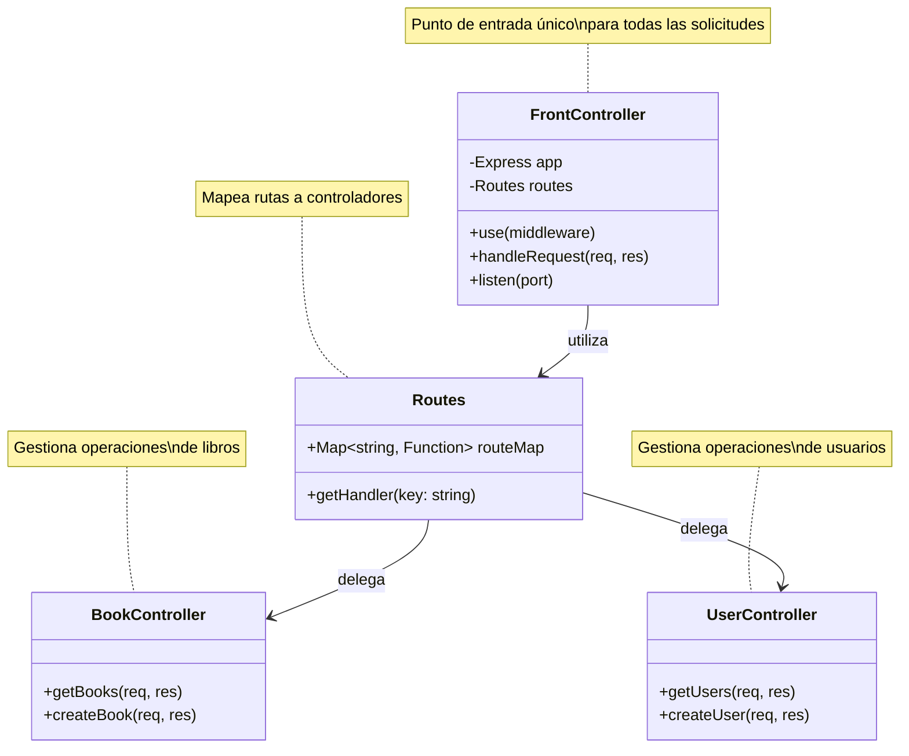
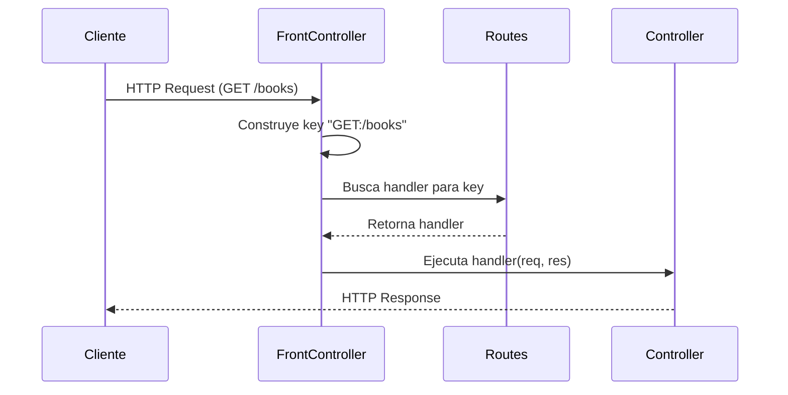

# Patrón Front Controller

## Descripción

El patrón **Front Controller** es un patrón de diseño empresarial que proporciona un punto centralizado de entrada para todas las solicitudes web. En lugar de que cada solicitud vaya directamente a diferentes componentes, el Front Controller actúa como un punto de entrada único que procesa todas las solicitudes y las dirige al controlador apropiado.

## Ventajas del Patrón

- **Centralización**: Todas las solicitudes pasan por un único punto de entrada
- **Seguridad**: Facilita la implementación de autenticación y autorización
- **Mantenibilidad**: Simplifica la gestión de rutas y el enrutamiento
- **Reutilización**: Permite aplicar lógica común a todas las solicitudes
- **Separación de Responsabilidades**: Separa la lógica de enrutamiento de la lógica de negocio

## Diagrama de Clases UML



## Diagrama de Secuencia



## Estructura del Proyecto

```
FrontController/
├── index.js                 # Front Controller principal
├── routes.js                # Configuración de rutas
├── package.json             # Dependencias del proyecto
└── controllers/
    ├── bookController.js    # Controlador de libros
    └── userController.js    # Controlador de usuarios
```

## Instalación

1. **Clonar o descargar el proyecto**

2. **Instalar dependencias**:
   ```bash
   npm install
   ```

## Uso

### Iniciar el Servidor

```bash
npm start
```

El servidor se iniciará en el puerto 3000.

### Endpoints Disponibles

#### Libros

- **GET /books** - Obtener todos los libros
  ```bash
  curl http://localhost:3000/books
  ```
  Respuesta:
  ```json
  [
    { "id": 1, "title": "Clean Code" },
    { "id": 2, "title": "Design Patterns" }
  ]
  ```

- **POST /books** - Crear un nuevo libro
  ```bash
  curl -X POST http://localhost:3000/books \
    -H "Content-Type: application/json" \
    -d '{"title":"The Pragmatic Programmer","author":"Hunt & Thomas"}'
  ```
  Respuesta:
  ```json
  {
    "message": "Book created",
    "data": {
      "title": "The Pragmatic Programmer",
      "author": "Hunt & Thomas"
    }
  }
  ```

#### Usuarios

- **GET /users** - Obtener todos los usuarios
  ```bash
  curl http://localhost:3000/users
  ```
  Respuesta:
  ```json
  [
    { "id": 1, "name": "Josue" },
    { "id": 2, "name": "Maria" }
  ]
  ```

- **POST /users** - Crear un nuevo usuario
  ```bash
  curl -X POST http://localhost:3000/users \
    -H "Content-Type: application/json" \
    -d '{"name":"Carlos","email":"carlos@example.com"}'
  ```
  Respuesta:
  ```json
  {
    "message": "User created",
    "data": {
      "name": "Carlos",
      "email": "carlos@example.com"
    }
  }
  ```

## Implementación

### Agregar una Nueva Ruta

1. **Crear un nuevo controlador** (ejemplo: `controllers/productController.js`):
   ```javascript
   /**
    * Obtiene todos los productos
    * @param {Object} req - Objeto de solicitud Express
    * @param {Object} res - Objeto de respuesta Express
    */
   function getProducts(req, res) {
     res.json([
       { id: 1, name: "Laptop" },
       { id: 2, name: "Mouse" }
     ]);
   }

   module.exports = { getProducts };
   ```

2. **Registrar la ruta** en `routes.js`:
   ```javascript
   const productController = require("./controllers/productController");

   const routes = {
     // ... rutas existentes
     "GET:/products": productController.getProducts
   };
   ```

3. **Probar la nueva ruta**:
   ```bash
   curl http://localhost:3000/products
   ```

## Flujo de Trabajo

1. **Cliente realiza una solicitud HTTP** → El cliente envía una petición (ej: GET /books)

2. **Front Controller recibe la solicitud** → El middleware en `index.js` intercepta todas las solicitudes

3. **Construcción de la clave de ruta** → Se construye una clave combinando el método HTTP y la ruta (ej: "GET:/books")

4. **Búsqueda del handler** → Se busca el handler correspondiente en el objeto `routes`

5. **Validación** → Si no existe el handler, se retorna un error 404

6. **Ejecución del controlador** → Si existe, se ejecuta el handler correspondiente

7. **Respuesta al cliente** → El controlador procesa la solicitud y envía una respuesta

## Manejo de Errores

El Front Controller implementa manejo de errores en dos niveles:

- **404 Not Found**: Cuando no se encuentra una ruta registrada
- **500 Internal Server Error**: Cuando ocurre un error durante la ejecución del handler

## Convenciones de Código

- Los nombres de las funciones utilizan camelCase
- Los controladores agrupan funciones relacionadas por recurso
- Las rutas siguen el formato: `"MÉTODO:/ruta"`
- Los nombres de variables son descriptivos y autoexplicativos

## Tecnologías Utilizadas

- **Node.js**: Entorno de ejecución
- **Express.js**: Framework web

## Autor

Desarrollo académico - Temas Selectos de Programación

## Licencia

ISC
