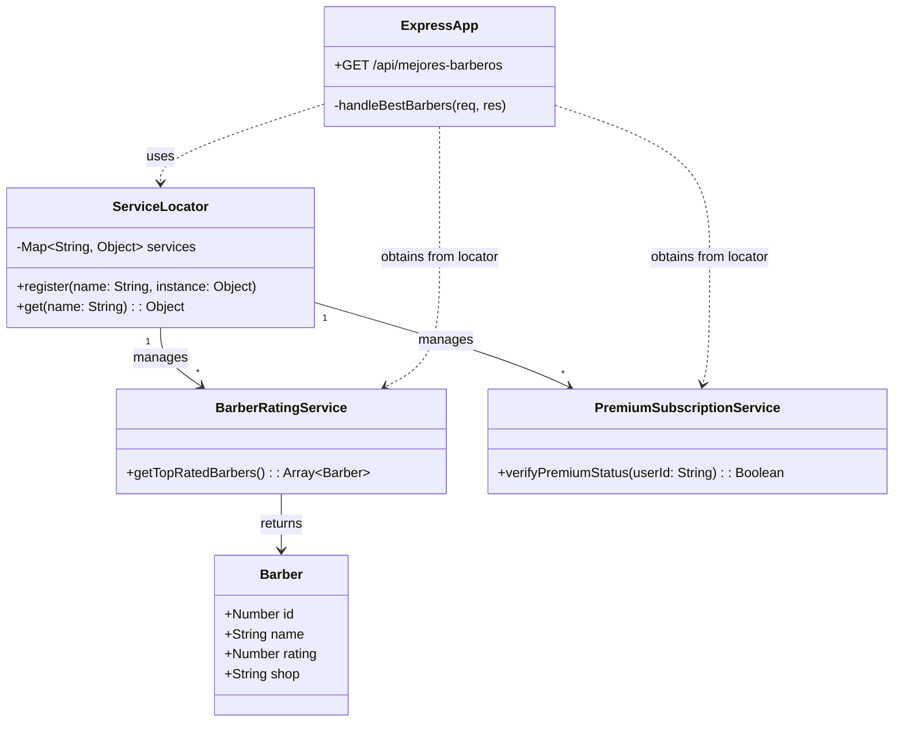
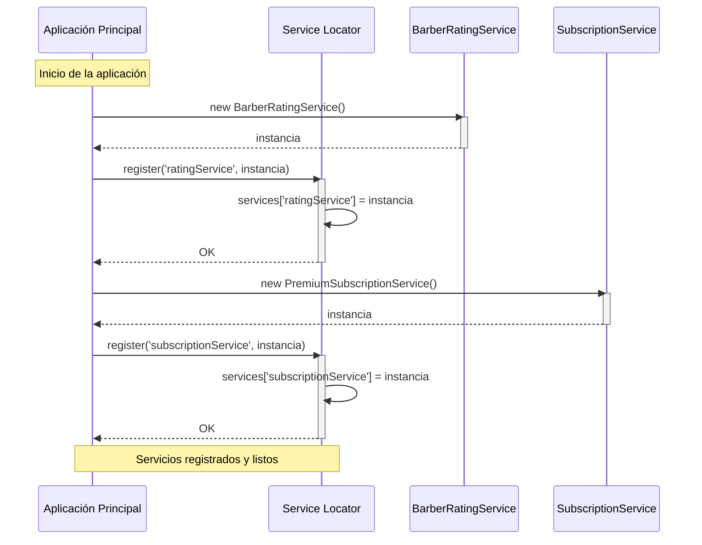
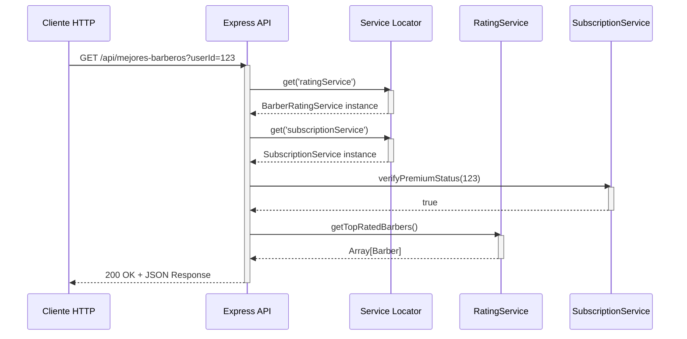
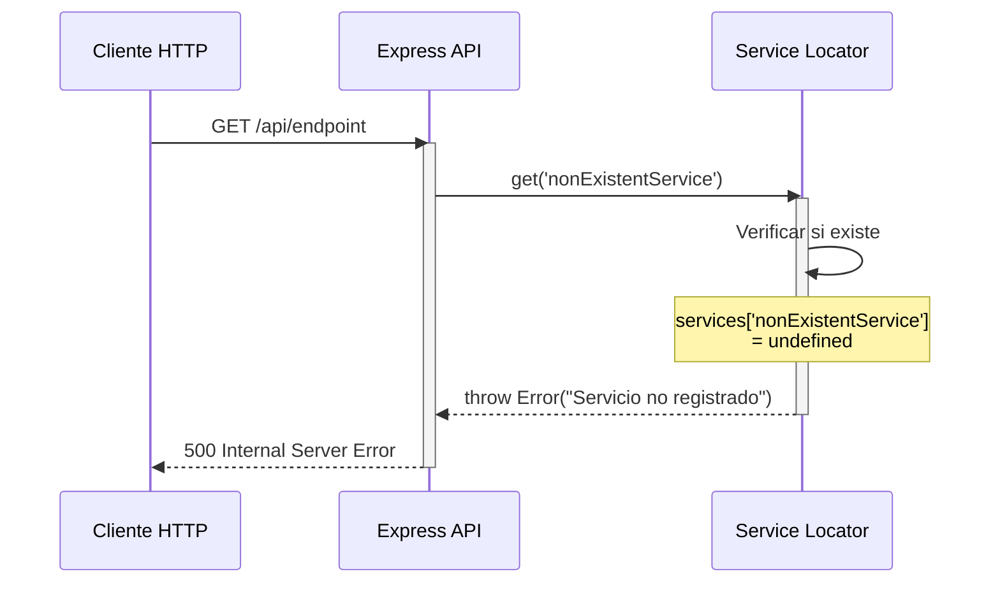
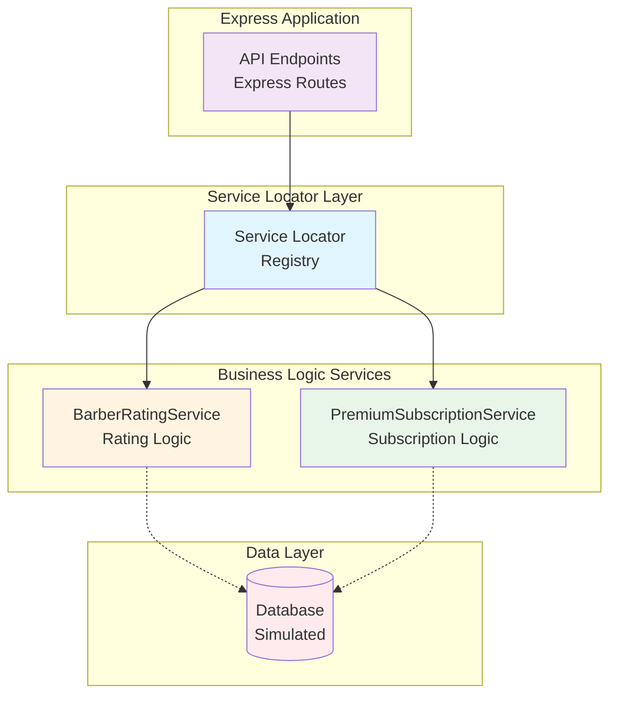
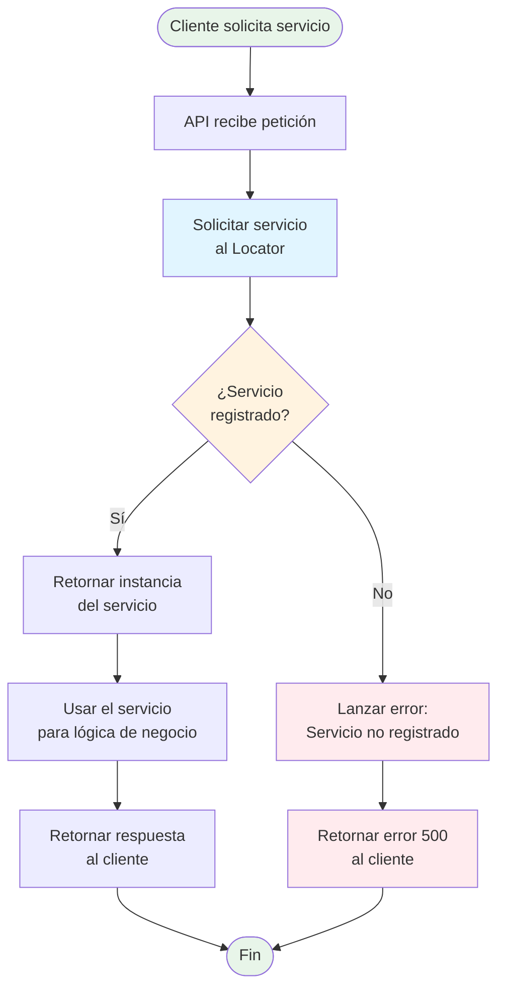
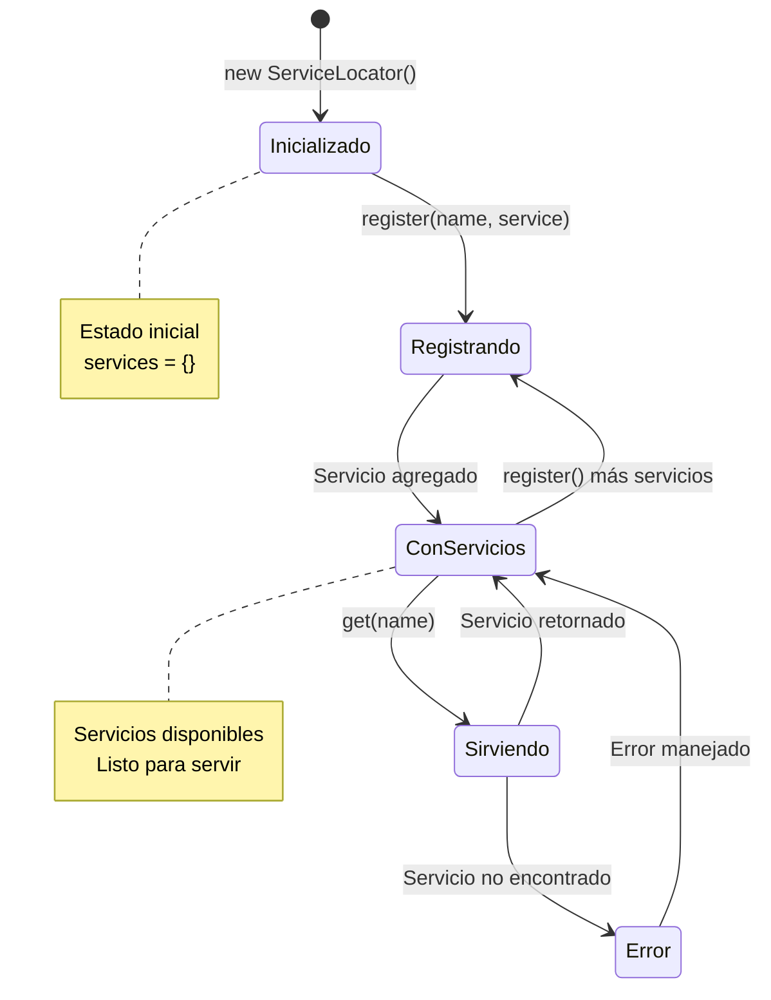

# 🔍 Service Locator Pattern

## 📋 Descripción

Implementación del **Patrón Service Locator** utilizando Node.js y Express. Este patrón proporciona un registro centralizado para servicios, permitiendo que los componentes de la aplicación obtengan referencias a servicios sin conocer sus implementaciones concretas.

### ¿Qué es el Patrón Service Locator?

Es un patrón de diseño que actúa como un registro centralizado donde los servicios son registrados y desde donde pueden ser recuperados. Funciona como un "directorio de servicios" o "conserje" que sabe dónde encontrar cada servicio cuando se necesita.

**Componentes principales:**
- ✅ **Service Locator**: Registro centralizado que mantiene referencias a servicios
- ✅ **Services**: Implementaciones concretas de funcionalidades
- ✅ **Client**: Componentes que necesitan usar los servicios

## 🎯 Ventajas

- **Desacoplamiento**: Los clientes no necesitan conocer las implementaciones concretas
- **Centralización**: Único punto de registro y acceso a servicios
- **Flexibilidad**: Fácil intercambio de implementaciones de servicios
- **Reutilización**: Los servicios se instancian una sola vez y se reutilizan
- **Testabilidad**: Fácil sustitución de servicios reales por mocks

## 🎨 Desventajas

- **Acoplamiento al Locator**: Dependencia del Service Locator en toda la aplicación
- **Anti-patrón**: Considerado por algunos como anti-patrón (oculta dependencias)
- **Dificulta testing**: No es evidente qué servicios necesita un componente
- **Alternativa moderna**: Dependency Injection es preferida actualmente

## 🏛️ Arquitectura del Sistema

### Diagrama de Arquitectura

```mermaid
graph TB
    Client[Client / API Endpoint]
    SL[Service Locator<br/>Registry]
    
    subgraph "Servicios Registrados"
        RS[BarberRatingService]
        SS[PremiumSubscriptionService]
    end
    
    Client -->|1. get('ratingService')| SL
    Client -->|2. get('subscriptionService')| SL
    SL -->|3. Retorna instancia| RS
    SL -->|4. Retorna instancia| SS
    
    style SL fill:#e1f5ff
    style Client fill:#f3e5f5
    style RS fill:#fff4e1
    style SS fill:#e8f5e9
```

## 📊 Diagramas UML

### 1. Diagrama de Clases



### 2. Diagrama de Secuencia - Registro de Servicios



### 3. Diagrama de Secuencia - Obtención y Uso de Servicios



### 4. Diagrama de Secuencia - Error: Servicio No Registrado



### 5. Diagrama de Componentes



### 6. Diagrama de Flujo - Obtención de Servicio



### 7. Diagrama de Estados del Service Locator



## 🔧 Componentes del Sistema

### 1. Service Locator

Registro centralizado que mantiene un mapa de servicios registrados.

**Métodos:**
- `register(name, instance)` - Registra un servicio con un nombre
- `get(name)` - Obtiene una instancia de servicio por nombre

### 2. BarberRatingService

Servicio que proporciona información sobre barberos mejor calificados.

**Métodos:**
- `getTopRatedBarbers()` - Retorna array de barberos top

**Modelo de Datos:**
```javascript
{
  id: number,
  name: string,
  rating: number,
  shop: string
}
```

### 3. PremiumSubscriptionService

Servicio que verifica el estado de suscripción premium de usuarios.

**Métodos:**
- `verifyPremiumStatus(userId)` - Verifica si un usuario es premium

### 4. Express API

Endpoint REST que utiliza el Service Locator para obtener servicios.

**Endpoints:**
- `GET /api/mejores-barberos?userId={id}` - Obtiene barberos top

## 📦 Requisitos Previos

- **Node.js**: v14.0.0 o superior
- **npm**: v6.0.0 o superior

## 🔧 Instalación

```bash
# Clonar o navegar al directorio
cd "Service Locator"

# Instalar dependencias
npm install
```

## ▶️ Ejecución

```bash
# Iniciar el servidor
npm start

# O directamente con Node
node server.js
```

El servidor estará disponible en `http://localhost:3000`

## 📝 Uso Básico

### Obtener Mejores Barberos

```bash
curl http://localhost:3000/api/mejores-barberos?userId=123
```

**Respuesta:**
```json
{
  "message": "Mejores barberos encontrados",
  "premiumUser": true,
  "data": [
    {
      "id": 1,
      "name": "Hugo",
      "rating": 5.0,
      "shop": "Barbería Clásica"
    },
    {
      "id": 2,
      "name": "Carlos",
      "rating": 4.8,
      "shop": "Estilo Urbano"
    }
  ]
}
```

## 🏗️ Estructura del Proyecto

```
Service Locator/
├── server.js          # Implementación completa del patrón
├── package.json       # Dependencias del proyecto
├── README.md          # Documentación con UML
└── .gitignore        # Archivos a ignorar en git
```

## 🛠️ Tecnologías

| Tecnología | Versión | Propósito |
|-----------|---------|-----------|
| Node.js | v14+ | Runtime de JavaScript |
| Express | ^5.2.1 | Framework web |

## 🎓 Conceptos Demostrados

1. **Service Locator Pattern**: Registro centralizado de servicios
2. **Singleton Pattern**: El locator es una instancia única global
3. **Dependency Lookup**: Búsqueda activa de dependencias
4. **Service Registry**: Registro de servicios disponibles
5. **Loose Coupling**: Desacoplamiento entre clientes y servicios

## 🔄 Flujo de Ejecución

1. **Inicialización**: Se crea instancia global de ServiceLocator
2. **Registro**: Los servicios se registran en el locator al iniciar
3. **Solicitud**: Cliente hace petición HTTP al API
4. **Lookup**: API solicita servicios al locator
5. **Uso**: API utiliza los servicios obtenidos
6. **Respuesta**: Se retorna resultado al cliente

## ⚖️ Service Locator vs Dependency Injection

| Aspecto | Service Locator | Dependency Injection |
|---------|----------------|----------------------|
| Obtención de deps | Activa (pull) | Pasiva (push) |
| Claridad | Oculta dependencias | Dependencias explícitas |
| Acoplamiento | Al locator | A interfaces |
| Testing | Más difícil | Más fácil |
| Modernidad | Patrón antiguo | Patrón preferido |

## 🚨 Consideraciones

### Ventajas Prácticas
- Implementación simple y directa
- No requiere frameworks adicionales
- Útil en aplicaciones pequeñas o prototipos
- Rápido de configurar

### Desventajas en Producción
- Oculta las dependencias reales de los componentes
- Dificulta el análisis estático del código
- Complica el testing unitario
- Crea acoplamiento global al locator
- Dependency Injection es generalmente preferida

## 💡 Alternativas Modernas

En lugar de Service Locator, considera usar:

- **Dependency Injection (DI)**: Inversify, TypeDI, Awilix
- **IoC Containers**: NestJS, Angular
- **Factory Pattern**: Para instanciación dinámica
- **Constructor Injection**: Para dependencias explícitas

## 📖 Recursos Adicionales

- [Service Locator Pattern - Martin Fowler](https://martinfowler.com/articles/injection.html#UsingAServiceLocator)
- [Design Patterns - Gang of Four](https://www.oreilly.com/library/view/design-patterns-elements/0201633612/)
- [Express.js Documentation](https://expressjs.com/)

## 📄 Licencia

ISC License

## ✨ Contexto

Este proyecto implementa el patrón Service Locator para un sistema de barbería (PrimeCorte), donde:
- Se gestionan calificaciones de barberos
- Se verifica el estado premium de usuarios
- Se centraliza el acceso a servicios de negocio

---

**⚠️ Nota:** Este patrón es útil para demostración y aprendizaje. Para aplicaciones en producción, considera usar **Dependency Injection** como alternativa más robusta y mantenible.
