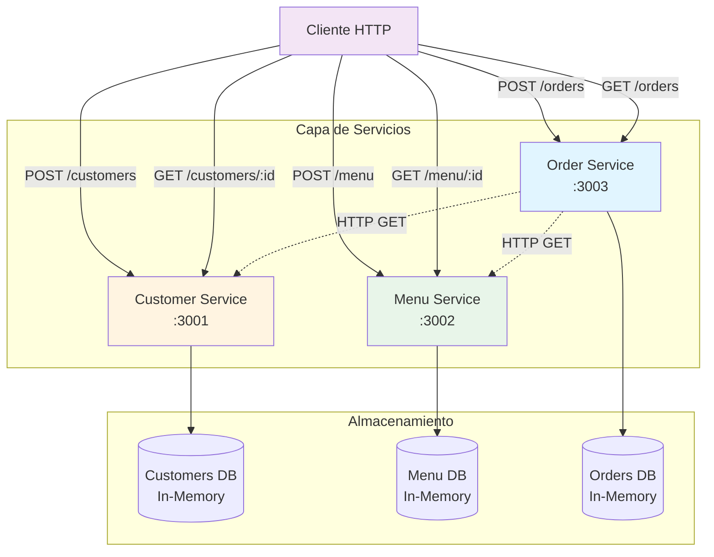
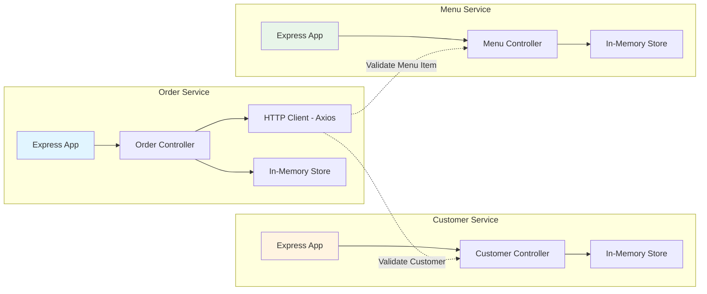
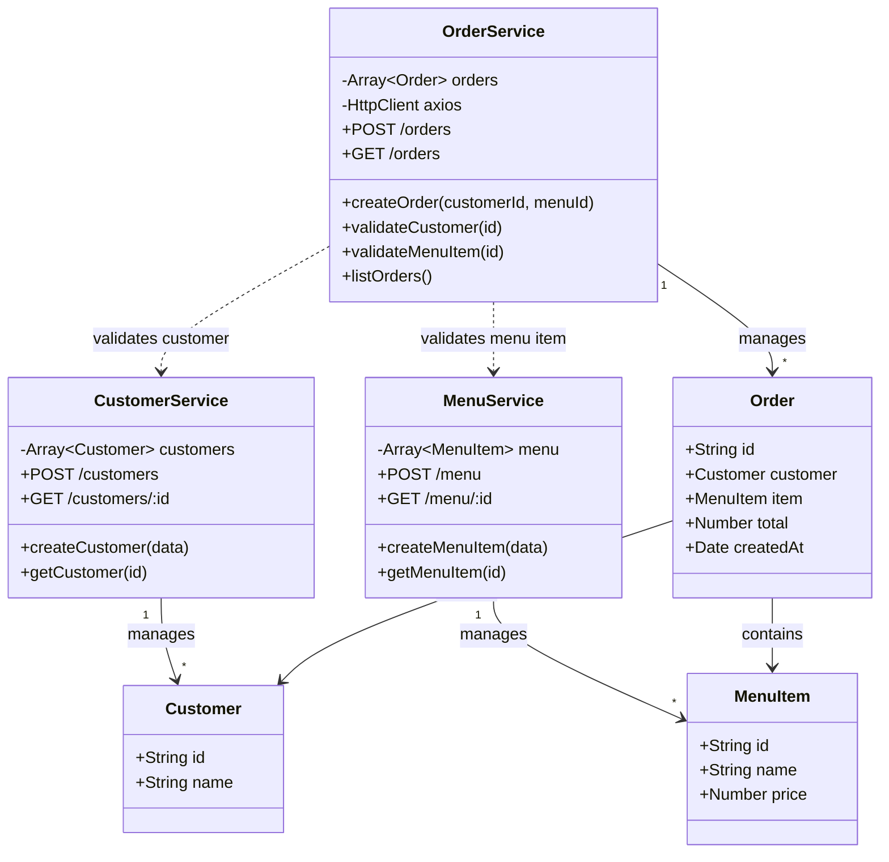
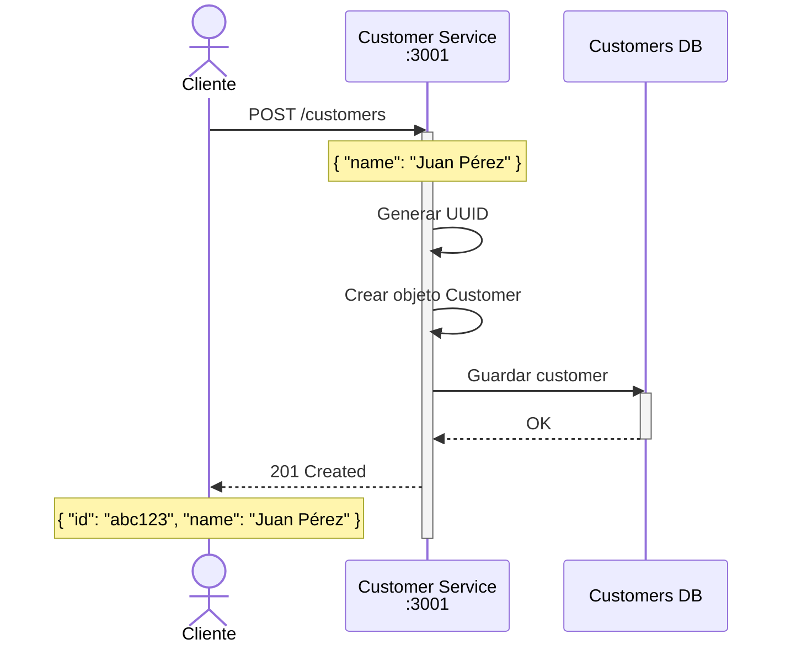
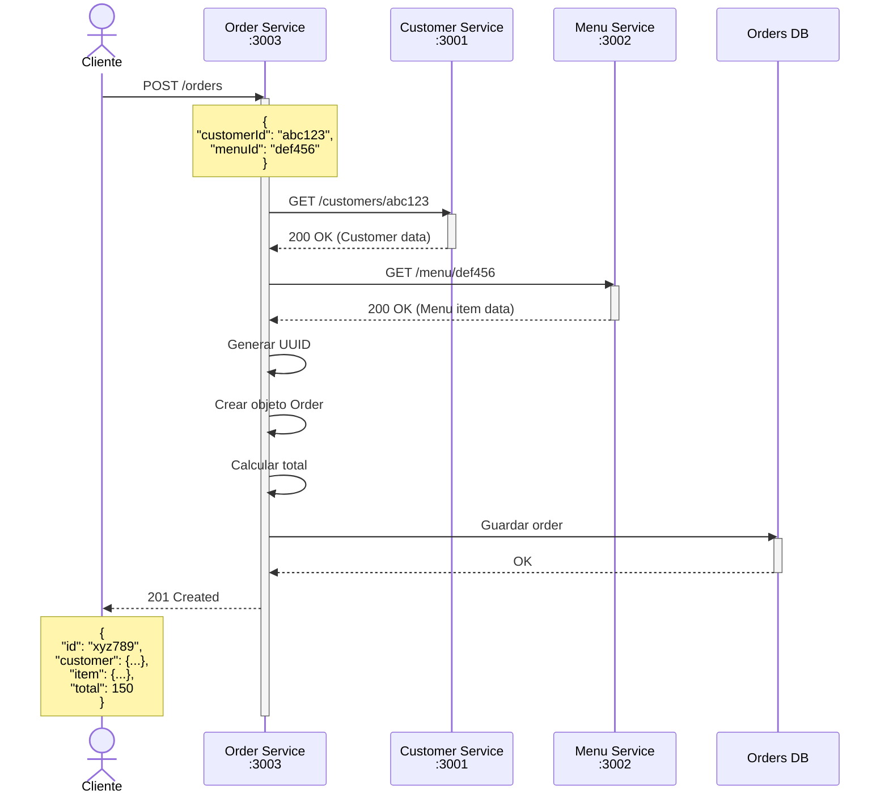
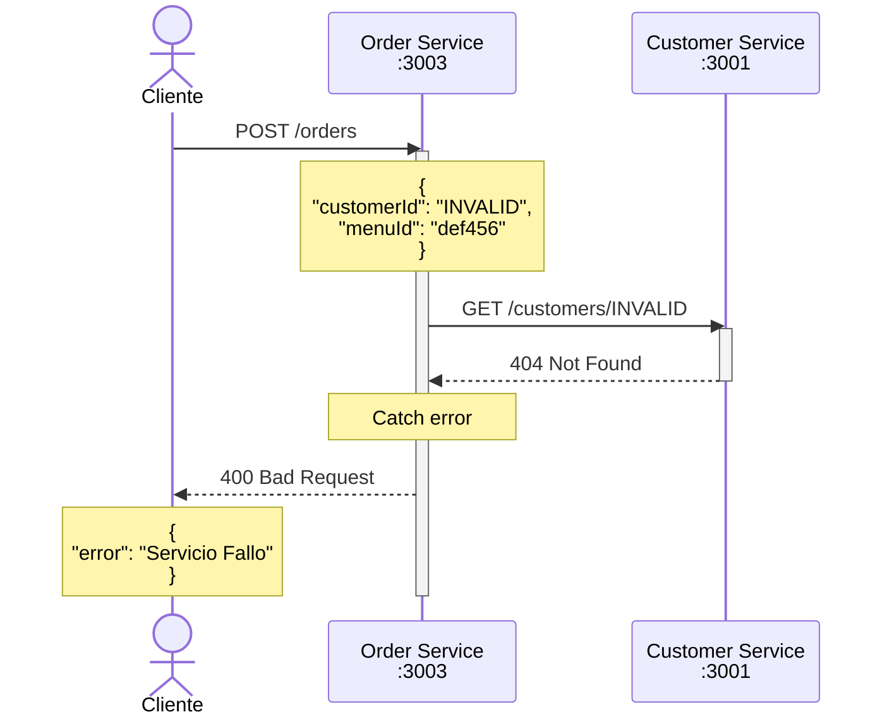
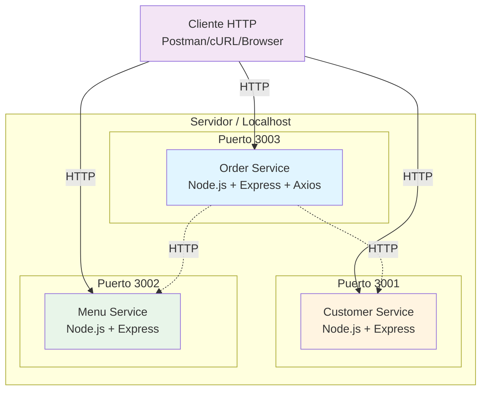
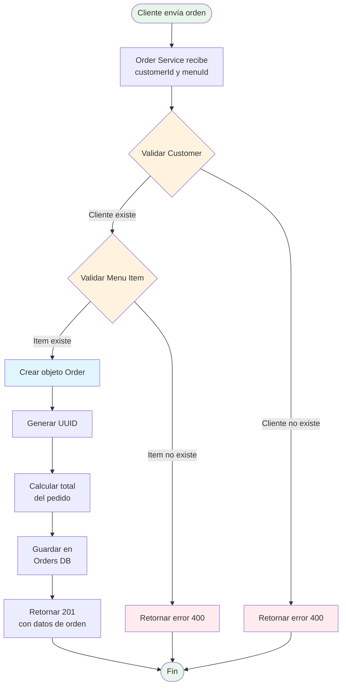

# 🏗️ Arquitectura de Microservicios

## 📋 Descripción

Implementación del **Patrón de Arquitectura de Microservicios** utilizando Node.js y Express. Este sistema demuestra cómo descomponer una aplicación monolítica en servicios independientes, cada uno con su propia responsabilidad y base de datos en memoria.

### ¿Qué es el Patrón de Microservicios?

Es un estilo arquitectural que estructura una aplicación como una colección de servicios pequeños, autónomos y débilmente acoplados. Cada microservicio:

- ✅ Se ejecuta en su propio proceso
- ✅ Tiene una responsabilidad única (Single Responsibility Principle)
- ✅ Se comunica a través de APIs REST
- ✅ Puede ser desarrollado, desplegado y escalado independientemente
- ✅ Puede usar diferentes tecnologías y bases de datos

## 🎯 Ventajas

- **Escalabilidad Independiente**: Escala solo los servicios que lo necesiten
- **Desarrollo Paralelo**: Equipos pueden trabajar en servicios diferentes simultáneamente
- **Tecnología Heterogénea**: Cada servicio puede usar la mejor tecnología para su propósito
- **Resiliencia**: La falla de un servicio no afecta a todos los demás
- **Despliegue Continuo**: Desplegar servicios individualmente sin afectar el sistema completo

## 🏛️ Arquitectura del Sistema

### Diagrama de Arquitectura de Microservicios



### Diagrama de Componentes



## 📊 Diagramas UML

### 1. Diagrama de Clases



### 2. Diagrama de Secuencia - Crear Cliente



### 3. Diagrama de Secuencia - Crear Orden (Comunicación entre Microservicios)



### 4. Diagrama de Secuencia - Error en Validación



### 5. Diagrama de Despliegue



### 6. Diagrama de Flujo - Proceso de Crear Orden



## 🚀 Servicios

### 1. Customer Service (Puerto 3001)

Gestiona la información de los clientes.

**Endpoints:**
- `POST /customers` - Crear nuevo cliente
- `GET /customers/:id` - Obtener cliente por ID

**Modelo de Datos:**
```javascript
{
  id: "uuid",
  name: "string"
}
```

### 2. Menu Service (Puerto 3002)

Gestiona el catálogo de productos del menú.

**Endpoints:**
- `POST /menu` - Crear nuevo producto
- `GET /menu/:id` - Obtener producto por ID

**Modelo de Datos:**
```javascript
{
  id: "uuid",
  name: "string",
  price: number
}
```

### 3. Order Service (Puerto 3003)

Gestiona las órdenes y coordina con otros servicios.

**Endpoints:**
- `POST /orders` - Crear nueva orden
- `GET /orders` - Listar todas las órdenes

**Modelo de Datos:**
```javascript
{
  id: "uuid",
  customer: {Customer},
  item: {MenuItem},
  total: number,
  createdAt: Date
}
```

## 📦 Requisitos Previos

- **Node.js**: v14.0.0 o superior
- **npm**: v6.0.0 o superior
- **Git**: Para clonar el repositorio

## 🔧 Instalación

### 1. Clonar el repositorio

```bash
git clone <repository-url>
cd microservicios
```

### 2. Instalar dependencias de cada servicio

**Opción A - Instalar todos los servicios:**

```bash
# Windows PowerShell
cd CustomerService; npm install; cd ..; cd MenuService; npm install; cd ..; cd OrderService; npm install; cd ..

# Linux/Mac
cd CustomerService && npm install && cd .. && cd MenuService && npm install && cd .. && cd OrderService && npm install && cd ..
```

**Opción B - Instalar uno por uno:**

```bash
# Customer Service
cd CustomerService
npm install
cd ..

# Menu Service
cd MenuService
npm install
cd ..

# Order Service
cd OrderService
npm install
cd ..
```

## ▶️ Ejecución

### Método 1: Ejecución Manual (3 terminales)

**Terminal 1 - Customer Service:**
```bash
cd CustomerService
node index.js
```

**Terminal 2 - Menu Service:**
```bash
cd MenuService
node index.js
```

**Terminal 3 - Order Service:**
```bash
cd OrderService
node index.js
```

### Método 2: Script PowerShell (Windows)

Crea un archivo `start-services.ps1`:

```powershell
# Iniciar Customer Service
Start-Process powershell -ArgumentList "-NoExit", "-Command", "cd CustomerService; node index.js"

# Esperar 2 segundos
Start-Sleep -Seconds 2

# Iniciar Menu Service
Start-Process powershell -ArgumentList "-NoExit", "-Command", "cd MenuService; node index.js"

# Esperar 2 segundos
Start-Sleep -Seconds 2

# Iniciar Order Service
Start-Process powershell -ArgumentList "-NoExit", "-Command", "cd OrderService; node index.js"

Write-Host "✅ Todos los servicios iniciados correctamente" -ForegroundColor Green
```

Ejecutar:
```bash
.\start-services.ps1
```

### Método 3: Script Bash (Linux/Mac)

Crea un archivo `start-services.sh`:

```bash
#!/bin/bash

# Iniciar Customer Service
cd CustomerService && node index.js &
CS_PID=$!
echo "Customer Service iniciado (PID: $CS_PID)"

# Iniciar Menu Service
cd ../MenuService && node index.js &
MS_PID=$!
echo "Menu Service iniciado (PID: $MS_PID)"

# Iniciar Order Service
cd ../OrderService && node index.js &
OS_PID=$!
echo "Order Service iniciado (PID: $OS_PID)"

echo "✅ Todos los servicios iniciados"
echo "Para detener: kill $CS_PID $MS_PID $OS_PID"

wait
```

Ejecutar:
```bash
chmod +x start-services.sh
./start-services.sh
```

## 🧪 Verificación

Verifica que todos los servicios estén ejecutándose:

```bash
# Windows PowerShell
curl http://localhost:3001/customers/test  # Debería retornar 404
curl http://localhost:3002/menu/test       # Debería retornar 404
curl http://localhost:3003/orders           # Debería retornar []
```

## 📝 Uso Básico

### 1. Crear un Cliente

```bash
curl -X POST http://localhost:3001/customers \
  -H "Content-Type: application/json" \
  -d '{"name": "Juan Pérez"}'
```

**Respuesta:**
```json
{
  "id": "550e8400-e29b-41d4-a716-446655440000",
  "name": "Juan Pérez"
}
```

### 2. Crear un Producto

```bash
curl -X POST http://localhost:3002/menu \
  -H "Content-Type: application/json" \
  -d '{"name": "Pizza Margherita", "price": 150}'
```

**Respuesta:**
```json
{
  "id": "6ba7b810-9dad-11d1-80b4-00c04fd430c8",
  "name": "Pizza Margherita",
  "price": 150
}
```

### 3. Crear una Orden

```bash
curl -X POST http://localhost:3003/orders \
  -H "Content-Type: application/json" \
  -d '{
    "customerId": "550e8400-e29b-41d4-a716-446655440000",
    "menuId": "6ba7b810-9dad-11d1-80b4-00c04fd430c8"
  }'
```

**Respuesta:**
```json
{
  "id": "7c9e6679-7425-40de-944b-e07fc1f90ae7",
  "customer": {
    "id": "550e8400-e29b-41d4-a716-446655440000",
    "name": "Juan Pérez"
  },
  "item": {
    "id": "6ba7b810-9dad-11d1-80b4-00c04fd430c8",
    "name": "Pizza Margherita",
    "price": 150
  },
  "total": 150,
  "createdAt": "2026-02-28T12:30:00.000Z"
}
```

## 📚 Estructura del Proyecto

```
microservicios/
├── CustomerService/
│   ├── index.js          # Servicio de clientes
│   ├── package.json      # Dependencias
│   └── node_modules/     # Paquetes instalados
├── MenuService/
│   ├── index.js          # Servicio de menú
│   ├── package.json      # Dependencias
│   └── node_modules/     # Paquetes instalados
├── OrderService/
│   ├── index.js          # Servicio de órdenes
│   ├── package.json      # Dependencias (incluye axios)
│   └── node_modules/     # Paquetes instalados
├── README.md             # Este archivo
├── EJEMPLOS.md           # Ejemplos de uso
└── GUIA_RAPIDA.md        # Guía rápida
```

## 🔍 Características Técnicas

- **Express**: Framework web minimalista para Node.js
- **UUID**: Generación de identificadores únicos
- **Axios** (OrderService): Cliente HTTP para comunicación entre servicios
- **In-Memory Storage**: Base de datos en memoria (se reinicia al detener el servicio)
- **RESTful API**: Arquitectura REST estándar
- **JSON**: Formato de intercambio de datos

## 🛠️ Tecnologías

| Tecnología | Versión | Propósito |
|-----------|---------|-----------|
| Node.js | v14+ | Runtime de JavaScript |
| Express | ^5.2.1 | Framework web |
| UUID | ^13.0.0 | Generación de IDs únicos |
| Axios | ^1.13.5 | Cliente HTTP (OrderService) |

## 🎓 Conceptos Demostrados

1. **Microservicios**: Separación de responsabilidades en servicios independientes
2. **Service Discovery**: Cada servicio conoce la ubicación de los demás
3. **API Gateway Pattern**: OrderService actúa como orquestador
4. **Database per Service**: Cada servicio tiene su propio almacenamiento
5. **Synchronous Communication**: Comunicación HTTP síncrona entre servicios
6. **Error Handling**: Manejo de errores en comunicación entre servicios

## ⚠️ Limitaciones

- **Base de datos en memoria**: Los datos se pierden al reiniciar los servicios
- **Sin Service Discovery**: URLs hardcodeadas (en producción usar Consul, Eureka, etc.)
- **Sin API Gateway**: Clientes deben conocer todos los endpoints (usar Kong, Nginx, etc.)
- **Sin Circuit Breaker**: No hay protección contra cascada de fallos (usar Hystrix, resilience4j)
- **Sin autenticación**: No implementa seguridad (usar JWT, OAuth2)
- **Sin logging centralizado**: No hay trazabilidad (usar ELK, Splunk)
- **Sin monitoreo**: No hay métricas (usar Prometheus, Grafana)

## 🚀 Mejoras Futuras

- [ ] Implementar base de datos real (MongoDB, PostgreSQL)
- [ ] Agregar Service Discovery (Consul)
- [ ] Implementar API Gateway (Kong, Express Gateway)
- [ ] Agregar Circuit Breaker Pattern (Opossum)
- [ ] Implementar Event-Driven Architecture (RabbitMQ, Kafka)
- [ ] Agregar autenticación y autorización (JWT)
- [ ] Implementar logging centralizado (Winston + ELK)
- [ ] Agregar monitoreo y métricas (Prometheus + Grafana)
- [ ] Contenedorizar con Docker
- [ ] Orquestar con Kubernetes

## 📖 Recursos Adicionales

- [Microservices Pattern](https://microservices.io/)
- [Martin Fowler - Microservices](https://martinfowler.com/articles/microservices.html)
- [Express.js Documentation](https://expressjs.com/)
- [Node.js Best Practices](https://github.com/goldbergyoni/nodebestpractices)

## 🤝 Contribución

1. Fork el proyecto
2. Crea una rama para tu feature (`git checkout -b feature/AmazingFeature`)
3. Commit tus cambios (`git commit -m 'Add some AmazingFeature'`)
4. Push a la rama (`git push origin feature/AmazingFeature`)
5. Abre un Pull Request

## 📄 Licencia

ISC License

## ✨ Autor

Proyecto educativo para demostrar el patrón de Arquitectura de Microservicios.

---

**🎯 Recuerda:** Esta es una implementación educativa. En producción, considera usar herramientas adicionales para service discovery, API gateway, circuit breakers, y monitoreo.
