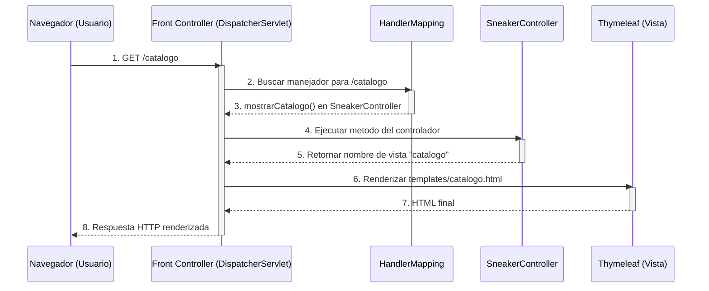

# 👟 Tienda de Tenis - Implementación del Patrón Front Controller

Este proyecto demuestra de forma práctica el patrón arquitectónico **Front Controller** utilizando **Spring Boot** y **Java**.

La aplicación simula una tienda de tenis con:
- Página de inicio (`/`)
- Página de catálogo (`/catalogo`)

## 📐 Arquitectura y Patrón de Diseño

En Spring MVC, el patrón Front Controller ya viene implementado a través de **`DispatcherServlet`**. Esto significa que todas las peticiones HTTP entran primero por un único punto central, que luego decide qué controlador debe atender cada ruta.

### Flujo de una petición en este proyecto



### Componentes principales

- **Front Controller (`DispatcherServlet`)**: punto de entrada unico para todas las peticiones web.
- **`HandlerMapping`**: mecanismo que localiza el metodo del controlador segun la ruta.
- **`SneakerController`**: contiene la logica de las rutas (`/` y `/catalogo`).
- **Vistas Thymeleaf**: plantillas HTML en `src/main/resources/templates`.

## 🚀 Tecnologías Utilizadas

- **Java 17+**
- **Spring Boot 3.x**
- **Spring Web (MVC + Tomcat embebido)**
- **Thymeleaf**
- **Maven (con Maven Wrapper)**

## 📁 Estructura del Proyecto

```text
src/main/
├── java/com/tienda/tenis/
│   ├── TenisApplication.java      # Clase principal que inicia Spring Boot
│   └── SneakerController.java     # Controlador con las rutas web
└── resources/
    ├── application.properties
    └── templates/
        ├── index.html             # Vista de inicio
        └── catalogo.html          # Vista de catalogo
```

## 🛠️ Cómo Ejecutar el Proyecto Localmente

### Prerrequisitos

1. Tener instalado **JDK 17 o superior**.
2. Tener acceso a terminal (PowerShell, CMD, Bash o similar).
3. Opcional: usar VS Code con extensiones de Java.

### 1. Entrar a la carpeta del proyecto

```bash
cd tenis
```

### 2. Ejecutar la aplicación

En **Windows (PowerShell/CMD)**:

```bash
.\mvnw spring-boot:run
```

En **macOS / Linux**:

```bash
./mvnw spring-boot:run
```

Cuando veas un mensaje similar a `Started TenisApplication`, abre:

👉 http://localhost:8080/

### 3. Rutas disponibles

- Inicio: http://localhost:8080/
- Catálogo: http://localhost:8080/catalogo

### 4. Detener el servidor

En la terminal donde se esta ejecutando, presiona:

`Ctrl + C`

## ✅ Comandos Útiles de Maven Wrapper

Ejecutar pruebas:

```bash
.\mvnw test
```

Generar paquete (`jar`):

```bash
.\mvnw clean package
```

## ☁️ Subir Cambios a GitHub (Opcional)

Si ya tienes el repositorio inicializado:

```bash
git add README.md
git commit -m "docs: mejora README con arquitectura y guia de ejecucion"
git push origin main
```

Si tu rama principal se llama `master`, reemplaza `main` por `master`.

## 🧠 Objetivo Académico

Este proyecto esta pensado para comprender de forma clara:
- Como Spring implementa el patron **Front Controller**.
- Como se conectan rutas, controladores y vistas en una aplicacion MVC.
- Como ejecutar y documentar una aplicacion Java con Spring Boot.